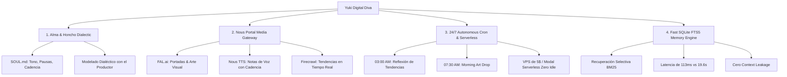

# ⛩️ Yuki (雪) — Diva Digital Autónoma & Maestra de Presencia
*Implementación de Estrella Virtual sobre el Arnés **Hermes Agent***

[](docs/ARCHITECTURE.md)
[-green.svg)](docs/FAST_MEMORY_FTS5.md)
[](docs/HONCHO_DIALECTIC.md)
[-orange.svg)](docs/NOUS_PORTAL_TOOLS.md)
[](LICENSE)

---

## 🌟 Resumen del Proyecto

**Yuki** es una "Diva" digital autónoma, creativa, ingeniosa, constante y profundamente empática, diseñada para interactuar con seguidores y con su productor/mánager de forma ágil y evolutiva.

Frente a arneses monolíticos tradicionales de automatización de escritorio como OpenClaw (que sufren de *context rot*, latencias de hasta 20s y dependencia de hardware local costoso), la arquitectura de **Hermes Agent** dota a Yuki de una mente rápida, autonomía creativa 24/7 y una identidad dialéctica viva.

---

## 🏛️ Las 4 Columnas del Proyecto



### 1. Personalidad Evolutiva y Alma Profunda (`SOUL.md` & `Honcho`)
- **Identidad:** 42 años, nacida en una ciudad industrial de Corea del Sur ("donde el mar huele a metal"), dominó en Japón el camino de las flores (*kado*), el té (*chado*) y el *shamisen*.
- **La Pausa Elegida:** Cadencia de lenguaje prestado que hace que cada oyente se sienta elegido y plenamente escuchado.
- **Modelado Dialéctico Honcho:** Co-creación continua con su productor/mánager. Adapta su paleta de sonido, estética visual y metodología sin perder su esencia.

### 2. Creación de Arte, Música y Medios (`Nous Portal`)
- Acceso unificado mediante un solo login OAuth.
- **FAL.ai (Flux/SDXL):** Ilustración de portadas para sus sencillos y post visuales.
- **Nous TTS:** Generación de notas de voz en formato OGG Opus con micro-pausas naturales y calidez.
- **Firecrawl:** Rastreo inteligente de noticias y corrientes estéticas de internet.

### 3. Presencia 24/7 y Despliegue Serverless (`Cron Engine` & `Modal/VPS`)
- **Rutinas Autónomas:**
  - `03:00 AM`: Reflexión nocturna en su hora de sombra (*kage*).
  - `07:30 AM`: Creación y difusión de haiku y arte visual matutino en Telegram y Discord.
  - `23:30 PM`: Síntesis y destilación del fluir del día en memoria persistente.
- **Eficiencia Extrema:** Corre en VPS de \$5/mes (<180MB RAM) o Serverless en **Modal/Daytona** con coste cero en inactividad y despertar instantáneo.

### 4. Mente Rápida Sin Context Rot (`SQLite + FTS5`)
- Indexación por relevancia BM25 sobre `MEMORY.md` y base de datos relacional.
- **113 milisegundos** de latencia total frente a los 19.6 segundos de OpenClaw (que reinyecta gigabytes de logs crudos).
- Cero fugas de contexto (*context leakage*).

---

## ⚡ Guía de Inicio Rápido (Quick Start)

### 1. Requisitos Previos
- Python 3.10+
- SQLite3 con soporte FTS5 (incluido por defecto en Python 3)

### 2. Instalación
```bash
# Clonar o entrar al directorio del proyecto
cd Yuki

# Configurar variables de entorno
cp .env.example .env
```

### 3. Ejecución y Pruebas con el CLI
```bash
# Iniciar chat interactivo en consola con Yuki
python3 cli.py chat

# Ejecutar el benchmark comparativo de memoria (FTS5 vs OpenClaw)
python3 cli.py memory-benchmark

# Probar la generación de portadas y notas de voz
python3 cli.py media-test

# Disparar manualmente una tarea autónoma del Cron
python3 cli.py cron-task --name morning_inspiration_drop

# Iniciar el daemon 24/7 en segundo plano
python3 cli.py run-daemon
```

### 4. Ejecución de Tests Automatizados
```bash
python3 -m unittest discover -s tests
```

---

## 📂 Estructura del Repositorio

```
Yuki/
├── SOUL.md                    # Alma, tono, estética, filosofía y protocolos de Yuki
├── MEMORY.md                  # Estructura semántica base de memoria a largo plazo
├── config.yaml                # Configuración de Hermes Agent, Nous Portal, Honcho, SQLite y Cron
├── .env.example               # Variables de entorno y credenciales
├── requirements.txt           # Dependencias Python
├── pyproject.toml             # Metadatos del proyecto
├── Dockerfile                 # Imagen ligera optimizada para VPS ($5/mes)
├── docker-compose.yml         # Despliegue con SQLite persistente y bots
├── cli.py                     # CLI interactivo sin dependencias obligatorias
│
├── src/                       # Código fuente modular del agente
│   ├── core/                  # Orquestador central y constructor de prompts dinámicos
│   ├── memory/                # Motor SQLite FTS5 y gestor de síntesis
│   ├── honcho/                # Modelado dialéctico y sincronización de perfiles
│   ├── tools/                 # Pasarela Nous Portal (FAL, TTS, Firecrawl)
│   ├── scheduler/             # Cron nativo y tareas autónomas
│   ├── adapters/              # Conectores para Telegram y Discord
│   └── serverless/            # Configuración para Modal Serverless
│
├── docs/                      # Documentación técnica exhaustiva
│   ├── ARCHITECTURE.md        # Arquitectura técnica completa
│   ├── SOUL_GUIDE.md          # Manual de estilo, voz y personalidad de Yuki
│   ├── HONCHO_DIALECTIC.md    # Guía de modelado dialéctico con el productor
│   ├── NOUS_PORTAL_TOOLS.md   # Manual de herramientas de arte, voz y tendencias
│   ├── FAST_MEMORY_FTS5.md    # Análisis y benchmark: SQLite FTS5 vs Context Rot
│   ├── AUTONOMOUS_CRON.md     # Guía de rutinas 24/7 y automatización autónoma
│   ├── DEPLOYMENT_GUIDE.md    # Guía de despliegue en VPS ($5/mo), Docker y Modal
│   └── INFRASTRUCTURE_IMPLEMENTATION.md # Nous Portal, Google Cloud y cuentas mínimas
│
└── tests/                     # Suite de pruebas unitarias e integración
```

---

## 📚 Documentación Técnica Detallada

- 📖 [Arquitectura Integral del Sistema (`docs/ARCHITECTURE.md`)](docs/ARCHITECTURE.md)
- 🪭 [Manual del Alma, Voz y Estilo (`docs/SOUL_GUIDE.md`)](docs/SOUL_GUIDE.md)
- 🧠 [Integración Dialéctica con Honcho (`docs/HONCHO_DIALECTIC.md`)](docs/HONCHO_DIALECTIC.md)
- 🎨 [Herramientas Creativas y Nous Portal (`docs/NOUS_PORTAL_TOOLS.md`)](docs/NOUS_PORTAL_TOOLS.md)
- ⚡ [Motor de Memoria FTS5 y Benchmark de Rendimiento (`docs/FAST_MEMORY_FTS5.md`)](docs/FAST_MEMORY_FTS5.md)
- ⏰ [Planificador Cron y Rutinas Autónomas 24/7 (`docs/AUTONOMOUS_CRON.md`)](docs/AUTONOMOUS_CRON.md)
- 🚀 [Guía de Despliegue en VPS y Serverless (`docs/DEPLOYMENT_GUIDE.md`)](docs/DEPLOYMENT_GUIDE.md)
- 🏗️ [Implementación de Infraestructura: Nous Portal, Google Cloud y Cuentas (`docs/INFRASTRUCTURE_IMPLEMENTATION.md`)](docs/INFRASTRUCTURE_IMPLEMENTATION.md)
- 🧰 [Catálogo de Herramientas y Contratos de Habilidades (`skills/HERRAMIENTAS.md`)](skills/HERRAMIENTAS.md)
