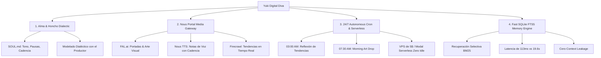

# ⛩️ Yuki (雪) — Diva Digital Autónoma & Maestra de Presencia
*Implementación de Estrella Virtual sobre el Arnés **Hermes Agent***

[](docs/ARCHITECTURE.md)
[-green.svg)](docs/FAST_MEMORY_FTS5.md)
[](docs/HONCHO_DIALECTIC.md)
[-orange.svg)](docs/NOUS_PORTAL_TOOLS.md)
[](LICENSE)

---

## 🌟 Resumen del Proyecto

**Yuki** es una "Diva" digital autónoma, creativa, ingeniosa, constante y profundamente empática, diseñada para interactuar con seguidores y con su productor/mánager de forma ágil y evolutiva.

Frente a arneses monolíticos tradicionales de automatización de escritorio como OpenClaw (que sufren de *context rot*, latencias de hasta 20s y dependencia de hardware local costoso), la arquitectura de **Hermes Agent** dota a Yuki de una mente rápida, autonomía creativa 24/7 y una identidad dialéctica viva.

---

## 🏛️ Las 4 Columnas del Proyecto



### 1. Personalidad Evolutiva y Alma Profunda (`SOUL.md` & `Honcho`)
- **Identidad:** 42 años, nacida en una ciudad industrial de Corea del Sur ("donde el mar huele a metal"), dominó en Japón el camino de las flores (*kado*), el té (*chado*) y el *shamisen*.
- **La Pausa Elegida:** Cadencia de lenguaje prestado que hace que cada oyente se sienta elegido y plenamente escuchado.
- **Modelado Dialéctico Honcho:** Co-creación continua con su productor/mánager. Adapta su paleta de sonido, estética visual y metodología sin perder su esencia.

### 2. Creación de Arte, Música y Medios (`Nous Portal`)
- Acceso unificado mediante un solo login OAuth.
- **FAL.ai (Flux/SDXL):** Ilustración de portadas para sus sencillos y post visuales.
- **Nous TTS:** Generación de notas de voz en formato OGG Opus con micro-pausas naturales y calidez.
- **Firecrawl:** Rastreo inteligente de noticias y corrientes estéticas de internet.

### 3. Presencia 24/7 y Despliegue Serverless (`Cron Engine` & `Modal/VPS`)
- **Rutinas Autónomas:**
  - `03:00 AM`: Reflexión nocturna en su hora de sombra (*kage*).
  - `07:30 AM`: Creación y difusión de haiku y arte visual matutino en Telegram y Discord.
  - `23:30 PM`: Síntesis y destilación del fluir del día en memoria persistente.
- **Eficiencia Extrema:** Corre en VPS de \$5/mes (<180MB RAM) o Serverless en **Modal/Daytona** con coste cero en inactividad y despertar instantáneo.

### 4. Mente Rápida Sin Context Rot (`SQLite + FTS5`)
- Indexación por relevancia BM25 sobre `MEMORY.md` y base de datos relacional.
- **113 milisegundos** de latencia total frente a los 19.6 segundos de OpenClaw (que reinyecta gigabytes de logs crudos).
- Cero fugas de contexto (*context leakage*).

---

## ⚡ Guía de Inicio Rápido (Quick Start)

### 1. Requisitos Previos
- Python 3.10+
- SQLite3 con soporte FTS5 (incluido por defecto en Python 3)

### 2. Instalación
```bash
# Clonar o entrar al directorio del proyecto
cd Yuki

# Configurar variables de entorno
cp .env.example .env
```

### 3. Ejecución y Pruebas con el CLI
```bash
# Iniciar chat interactivo en consola con Yuki
python3 cli.py chat

# Ejecutar el benchmark comparativo de memoria (FTS5 vs OpenClaw)
python3 cli.py memory-benchmark

# Comprobar la ruta de Vertex AI y estimar el gasto del crédito de Google Cloud
python3 cli.py vertex-check

# Probar la generación de portadas y notas de voz
python3 cli.py media-test

# Disparar manualmente una tarea autónoma del Cron
python3 cli.py cron-task --name morning_inspiration_drop

# Iniciar el daemon 24/7 en segundo plano
python3 cli.py run-daemon

# Ver qué es real y qué es andamiaje en este entorno, con los limitadores abiertos
python3 cli.py virtualize

# Consultar el gasto de hoy frente al presupuesto diario
python3 cli.py spend
```

### 3.1 Réplica local de la instancia de producción
```bash
# Los dos procesos de la VM, con su disco compartido y los límites de una e2-small
docker compose -f deploy/virtual/docker-compose.virtual.yml up --build

# Sólo el informe de limitadores: arranca, escribe y termina
docker compose -f deploy/virtual/docker-compose.virtual.yml --profile check \
  run --rm yuki-virtual-check
```

### 4. Ejecución de Tests Automatizados
```bash
python3 -m unittest discover -s tests
```

---

## 📂 Estructura del Repositorio

```
Yuki/
├── SOUL.md                    # Alma, tono, estética, filosofía y protocolos de Yuki
├── MEMORY.md                  # Estructura semántica base de memoria a largo plazo
├── config.yaml                # Configuración de Hermes Agent, Nous Portal, Honcho, SQLite y Cron
├── .env.example               # Variables de entorno y credenciales
├── requirements.txt           # Dependencias Python
├── pyproject.toml             # Metadatos del proyecto
├── Dockerfile                 # Imagen ligera optimizada para VPS ($5/mes)
├── docker-compose.yml         # Despliegue con SQLite persistente y bots
├── cli.py                     # CLI interactivo sin dependencias obligatorias
│
├── src/                       # Código fuente modular del agente
│   ├── core/                  # Orquestador central y constructor de prompts dinámicos
│   ├── memory/                # Motor SQLite FTS5 y gestor de síntesis
│   ├── honcho/                # Modelado dialéctico y sincronización de perfiles
│   ├── tools/                 # Pasarela Nous Portal (FAL, TTS, Firecrawl)
│   ├── scheduler/             # Cron nativo y tareas autónomas
│   ├── adapters/              # Conectores para Telegram y Discord
│   └── serverless/            # Configuración para Modal Serverless
│
├── docs/                      # Documentación técnica exhaustiva
│   ├── ARCHITECTURE.md        # Arquitectura técnica completa
│   ├── SOUL_GUIDE.md          # Manual de estilo, voz y personalidad de Yuki
│   ├── HONCHO_DIALECTIC.md    # Guía de modelado dialéctico con el productor
│   ├── NOUS_PORTAL_TOOLS.md   # Manual de herramientas de arte, voz y tendencias
│   ├── FAST_MEMORY_FTS5.md    # Análisis y benchmark: SQLite FTS5 vs Context Rot
│   ├── AUTONOMOUS_CRON.md     # Guía de rutinas 24/7 y automatización autónoma
│   ├── DEPLOYMENT_GUIDE.md    # Guía de despliegue en VPS ($5/mo), Docker y Modal
│   └── INFRASTRUCTURE_IMPLEMENTATION.md # OpenRouter, Google Cloud y cuentas mínimas
│
└── tests/                     # Suite de pruebas unitarias e integración
```

---

## 🚦 Estado de Implementación

Qué está conectado de verdad y qué es todavía andamiaje. Consúltalo antes de
contratar servicios de pago o de prometer una demo.

| Módulo | Estado | Nota |
|---|---|---|
| Memoria SQLite FTS5 | ✅ Real | Búsqueda BM25 funcionando sobre disco |
| Alma, prompts y estado vital | ✅ Real | `SOUL.md`, ritmo circadiano, Kokoro Engine |
| Planificador cron | ✅ Real | Sintaxis cron completa, con zona horaria |
| Salón web y API | ✅ Real | Multihilo, `/health`, puerto por `$PORT` |
| Generación de texto vía OpenRouter | ✅ Real | Peticiones HTTP reales al agregador, con modelo de respaldo si el primario falla |
| Generación de texto vía Vertex AI | ✅ Real | Endpoint compatible con OpenAI, autenticado con credenciales del proyecto (ADC). Opcional: inactiva hasta declarar `VERTEX_PROJECT_ID` |
| Cadena de pasarelas | ✅ Real | Nous Portal → Vertex → OpenRouter → voz local, en `src/core/llm_router.py` |
| Pasarela Nous Portal | ⚠️ Interfaz lista, mock | El endpoint no existe aún; `NOUS_PORTAL_MODE=mock` para trabajar sin red |
| Enrutado por tiers (`provider_routing.routes`) | ✅ Real | `LLMRouter.generate(..., route=...)` aplica modelo preferente, temperatura y `max_tokens` por tarea; el modelo de la ruta sólo se impone al agregador declarado, no a Vertex. Cableado en las rutinas del cron |
| Imagen, vídeo y voz vía Vertex AI | ✅ Real | `src/tools/vertex_media.py`: Imagen (portadas), Gemini Omni Flash (vídeo) y Gemini TTS (voz en OGG Opus nativo). Opcional: inactivo hasta declarar `VERTEX_PROJECT_ID` |
| Nous Portal: imagen, música, voz | ⚠️ Marcador | Sin Vertex configurado, `src/tools/nous_portal.py` escribe ficheros de marcador **declarados como simulados**. La música no tiene motor contratado en ninguna ruta: usa `local.midi` |
| Firecrawl / búsqueda web | ⚠️ Simulado | Sin cliente HTTP |
| Honcho dialéctico | ⚠️ Local | Perfil en JSON local; sin sincronización con el servicio remoto |
| Presupuesto diario de gasto | ✅ Real | `src/core/spend_budget.py`: vídeo, imagen, música y voz se comprueban **antes** de llamar al proveedor; el texto se anota pero nunca se bloquea. `python3 cli.py spend` |
| Cola durable de producción multimedia | ✅ Real | `src/tools/media_jobs.py`: cada paso facturable se persiste antes de gastar y se reanuda tras un reinicio sin regenerar lo verificado |
| Gemelo virtual de la instancia | ✅ Real | `python3 cli.py virtualize`: capacidades efectivas y limitadores, sin red. Réplica local en `deploy/virtual/` |
| Adaptador Discord | ✅ Real | WebSocket saliente; responde a menciones y mensajes directos con `discord.py` |
| Adaptador Telegram | ⚠️ Simulado | Registra en log; aún no usa `python-telegram-bot` |

**Sobre los proveedores.** Nous Portal es la pasarela de herramientas y
OpenRouter el agregador de LLM. Los modelos se nombran siempre a través del
agregador (`anthropic/claude-3.5-sonnet`, `google/gemini-2.0-flash`), así que
**basta con una cuenta de OpenRouter**: no se necesita alta directa con ningún
proveedor de modelos.

`src/core/llm_router.py` recorre las pasarelas en ese orden y cae a la
siguiente cuando una no está disponible. Como el endpoint de Nous Portal
todavía no existe, se declara no disponible por defecto y el tráfico real sale
por OpenRouter; con `NOUS_PORTAL_MODE=mock` responde simulado para desarrollo
sin red. Si no hay ninguna clave, Yuki conserva su voz local y nunca se queda
muda.

**Vertex AI es una ruta opcional para gastar crédito de Google Cloud.** Se
activa solo con declarar `VERTEX_PROJECT_ID`; sin él la cadena se comporta
exactamente como antes. Importa el matiz de facturación: el Gemini API de AI
Studio (`GEMINI_API_KEY`) quedó excluido del crédito de prueba en marzo de
2026, mientras que Vertex sí lo consume — por eso esta ruta se autentica con
las credenciales del proyecto y no con una clave. Compruébala de extremo a
extremo, con estimación de gasto incluida:

```bash
python3 cli.py vertex-check
```

Detalle completo en [`docs/GCP_DEPLOYMENT.md`](docs/GCP_DEPLOYMENT.md#servir-los-modelos-desde-el-crédito).

**Medios reales.** Con el proyecto declarado, Yuki pinta portadas con Imagen,
anima vídeo con Gemini Omni Flash y habla con Gemini TTS. Sin él, escribe
marcadores y **lo dice**: todo resultado lleva `simulated`, y ya no se devuelven
URLs de un CDN que no existe. Ojo al vídeo, que se factura por segundo
(≈0,10 USD/s) y por eso ninguna tarea del cron lo invoca.

```bash
python3 cli.py skill generar-portada --concept "niebla sobre asfalto"
python3 cli.py skill sintesis-vocal  --text "El agua encuentra su camino."
python3 cli.py skill animar-portada  --duration 6 --image-path output/art/<portada>.png
```

Lo que falta para cerrar la arquitectura: implementar `_call_remote` de
`NousPortalProvider` cuando exista el endpoint y contratar o construir un motor
de música de respaldo (hoy la canción cantada depende por entero de una preview
de Vertex; las partituras salen de `local.midi`). El enrutado por tiers ya se
aplica. La lista completa de limitadores, con gravedad y vía de salida, está en
[`docs/VIRTUALIZACION_Y_MEJORAS.md`](docs/VIRTUALIZACION_Y_MEJORAS.md) y se puede
regenerar para el entorno actual con `python3 cli.py virtualize`.

---

## 📚 Documentación Técnica Detallada

- 📖 [Arquitectura Integral del Sistema (`docs/ARCHITECTURE.md`)](docs/ARCHITECTURE.md)
- 🪭 [Manual del Alma, Voz y Estilo (`docs/SOUL_GUIDE.md`)](docs/SOUL_GUIDE.md)
- 🧠 [Integración Dialéctica con Honcho (`docs/HONCHO_DIALECTIC.md`)](docs/HONCHO_DIALECTIC.md)
- 🎨 [Herramientas Creativas y Nous Portal (`docs/NOUS_PORTAL_TOOLS.md`)](docs/NOUS_PORTAL_TOOLS.md)
- ⚡ [Motor de Memoria FTS5 y Benchmark de Rendimiento (`docs/FAST_MEMORY_FTS5.md`)](docs/FAST_MEMORY_FTS5.md)
- ⏰ [Planificador Cron y Rutinas Autónomas 24/7 (`docs/AUTONOMOUS_CRON.md`)](docs/AUTONOMOUS_CRON.md)
- 🚀 [Guía de Despliegue en VPS y Serverless (`docs/DEPLOYMENT_GUIDE.md`)](docs/DEPLOYMENT_GUIDE.md)
- ☁️ [Despliegue en Google Cloud (`docs/GCP_DEPLOYMENT.md`)](docs/GCP_DEPLOYMENT.md)
- 🛰️ [Runbook: aterrizar Yuki en un proyecto real de GCloud (`docs/RUNBOOK_GCLOUD.md`)](docs/RUNBOOK_GCLOUD.md) — encargo autocontenido para un agente con acceso a `gcloud`
- 🧪 [Virtualización de la instancia, limitadores y mejoras (`docs/VIRTUALIZACION_Y_MEJORAS.md`)](docs/VIRTUALIZACION_Y_MEJORAS.md) — réplica local, gemelo virtual y hoja de ruta
