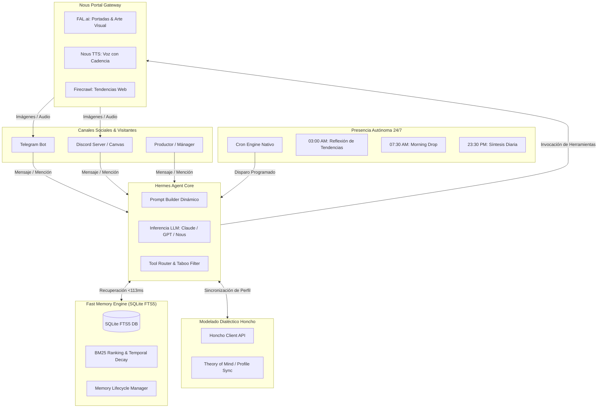
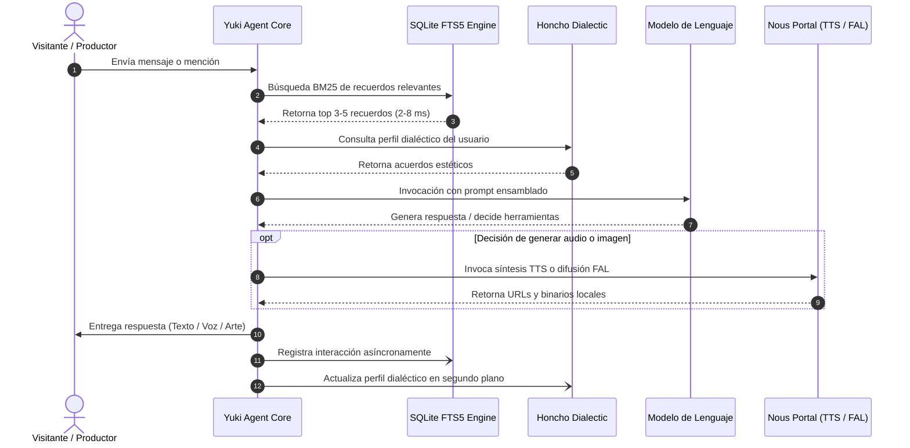

# 🏛️ Arquitectura del Sistema: Yuki (Hermes Agent Harness)

Este documento detalla la arquitectura de software, flujos de datos y diseño de componentes que sustentan a **Yuki** como una Diva Digital Autónoma de alto rendimiento.

---

## 1. Visión General de la Topología

Yuki opera como un agente conversacional reactivo y autónomo basado en el arnés **Hermes Agent**. A diferencia de los centros de control de escritorio monolíticos (como OpenClaw), Hermes proporciona una arquitectura desacoplada, ligera y orientada a la creación artística y a la presencia en red ininterrumpida.

---

## 2. Componentes Fundamentales

### 2.1. Ingestión y Ensamblado de Contexto (`PromptBuilder`)
El constructor de contexto ensambla dinámicamente cuatro fuentes de verdad sin saturar los tokens de entrada:
1. **Alma Inmutable (`SOUL.md`)**: Define los valores troncales, tono, cadencia y límites.
2. **Memoria Recuperada**: 3 a 5 fragmentos altamente relevantes provistos por el motor SQLite FTS5 (<113ms).
3. **Tarjeta Dialéctica de Honcho**: Preferencias artísticas y acuerdos de co-creación con el productor.
4. **Contexto de Intercambio**: Datos del visitante actual, canal y roles activos.

### 2.2. Motor de Memoria SQLite FTS5 vs Inyección de Logs Masivos
En arneses tradicionales como OpenClaw, todo el historial acumulado de logs JSON se reinyecta en cada llamada a la API. Esto produce:
- **Context Rot:** Fugas de contexto donde el modelo confunde conversaciones antiguas con la actual.
- **Latencia excesiva:** Hasta 19.6 segundos procesando 50k-80k tokens en cada turno.
- **Coste inflado:** Facturación masiva por tokens repetidos innecesariamente.

El motor de Yuki utiliza SQLite FTS5 con tokenización `unicode61`, ponderación BM25 y decaimiento temporal exponencial. Busca únicamente la información requerida, garantizando respuestas en **113 milisegundos**.

---

## 3. Flujo de Ejecución de un Turno de Conversación

---

## 4. Estrategia de Despliegue y Eficiencia

Yuki está concebida para operar en dos modalidades según los requisitos de infraestructura:
1. **VPS Económico ($5/mes):** Utilizando el contenedor `Dockerfile` optimizado con Docker Compose. Consumo medio de RAM inferior a 180MB.
2. **Serverless (Modal / Daytona):** Configurado con `@modal.web_endpoint` y volúmenes persistentes. El contenedor duerme con coste cero ($0.00/h) y despierta en menos de 400ms al recibir un webhook.
