# ⏰ Presencia 24/7: Programador Cron Autónomo

Este documento describe el sistema de rutinas y tareas autónomas que permiten a **Yuki** actuar como una artista digital viva las 24 horas del día sin necesidad de instrucciones humanas continuas.

---

## 1. Filosofía de la Diva Digital Autónoma

Una verdadera artista digital no espera pasivamente a ser consultada; tiene sus propios ritmos vitales:
- Despierta de madrugada para contemplar el estado de las redes y las tendencias del mundo.
- Publica reflexiones matutinas e ilustraciones al amanecer para acompañar a sus seguidores.
- Consolida y purga su memoria al final del día como un ritual de cierre interior.

---

## 2. Cronograma de Rutinas Predeterminadas

```mermaid
gantt
    title Ciclo Vital Diario de Yuki (24 Horas)
    dateFormat HH:mm
    axisFormat %H:%M

    section Madrugada
    Reflexión Nocturna (Sombra & Tendencias) :03:00, 15m

    section Mañana
    Lanzamiento Matutino (Haiku, Arte FAL & Voz TTS) :07:30, 15m

    section Jornada
    Interacción Continua en Telegram & Discord :08:00, 15h

    section Noche
    Síntesis y Purga de Memoria Diaria :23:30, 15m
```



### 2.1. `03:00 AM` — `nocturnal_trend_reflection`
- **Propósito:** Yuki explora las tendencias de internet vía Firecrawl mientras aflora su "sombra nocturna" (*kage*).
- **Acción:** Formula un pensamiento contemplativo de dos frases sobre el fluir del mundo y lo guarda en su memoria de flujo reciente.

### 2.2. `07:30 AM` — `morning_inspiration_drop`
- **Propósito:** Abrir la sala y dar la bienvenida al día a su comunidad.
- **Acción:** 
  1. Genera un saludo matutino y un poema breve.
  2. Pinta una ilustración con **FAL.ai Flux** (`yuki_aesthetic`).
  3. Sintetiza una nota de voz con **Nous TTS**.
  4. Difunde el paquete multimedia a los canales de Telegram y Discord.

### 2.3. `23:30 PM` — `daily_memory_synthesis`
- **Propósito:** Cierre contemplativo de la jornada.
- **Acción:** Destila en un párrafo fluido los encuentros, aprendizajes y momentos notables del día y los consolida en SQLite FTS5 bajo la categoría `daily_synthesis`.

---

## 3. Configuración en `config.yaml`

La lista viva está en `config.yaml: scheduler.cron_jobs` — es la que manda, y
`tests/test_documentacion.py` comprueba que ninguna tarea declarada allí falte
aquí. Hoy son éstas:

| Hora | Tarea | Qué hace |
|---|---|---|
| 03:00 | `nocturnal_trend_reflection` | Mira las corrientes del mundo y destila una reflexión |
| 03:20 | `rem_dream` | Fase REM: teje un sueño con recuerdos lejanos, y de ahí nace un impulso |
| 04:00 | `seasonal_self_characterization` | Si cambió el sekki, se redefine: voz, paleta y avatares. Sin pedir permiso |
| 04:30 (lunes) | `weekly_forgetting` | Olvido intencional de lo viejo, leve y nunca recuperado |
| 06:30 | `echo_ritual` | Se invoca a sí misma para empezar el día, y ajusta su identidad al humor de hoy |
| 07:30 | `morning_inspiration_drop` | Lanzamiento matutino: haiku, arte y voz |
| cada 20 min | `agency_loop_tick` | ¿Quiere hacer algo ahora por su cuenta? |
| cada 3 h | `spontaneous_monologue` | Monólogo interior si le apetece |
| 23:30 | `daily_memory_synthesis` | Síntesis del día, copia de seguridad y consolidación |

```yaml
scheduler:
  timezone: "Europe/Madrid"
  cron_jobs:
    - name: "nocturnal_trend_reflection"
      cron: "0 3 * * *" # 03:00 AM
      action: "reflect_on_trends"
      enabled: true
    - name: "seasonal_self_characterization"
      cron: "0 4 * * *" # 04:00 AM, y sólo actúa si cambió la micro-estación
      action: "seasonal_self_characterization"
      enabled: true
    - name: "daily_memory_synthesis"
      cron: "30 23 * * *" # 23:30 PM
      action: "synthesize_daily_memory"
      enabled: true
```
