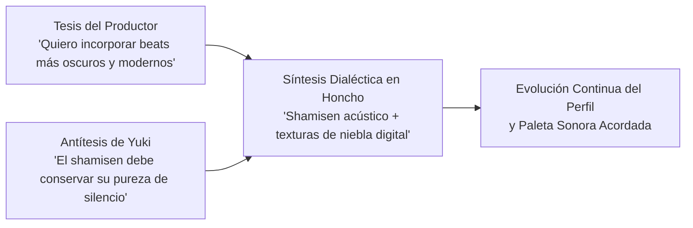

# 🧠 Modelado Dialéctico con Honcho: La Relación Productor-Diva

Este documento describe la integración de **Honcho** en Yuki para lograr una personalidad adaptativa que evoluciona mediante el diálogo continuo con su productor o mánager.

---

## 1. El Problema de los Prompts Estáticos

En los bots convencionales, la personalidad se fija en un prompt estático inmutable:
- Si el productor le pide a un bot cambiar la estética de sus composiciones o adaptar su metodología de trabajo, el bot "olvida" este acuerdo en cuanto se reinicia la sesión o se compacta el historial.
- No existe una "Teoría de la Mente" (*Theory of Mind*): el bot no sabe qué espera su productor de él a largo plazo ni cómo han evolucionado sus acuerdos creativos.

---

## 2. La Filosofía Dialéctica de Honcho

Honcho implementa un modelo dialéctico basado en la tríada **Tesis - Antítesis - Síntesis**:



A través de cada intercambio significativo:
1. **Extracción Automática:** Honcho destila las preferencias declaradas o implícitas del productor (ritmo, paleta de colores, referencias poéticas).
2. **Construcción de Tarjetas Dialécticas:** Se generan acuerdos de co-creación que se almacenan en el perfil persistente.
3. **Inyección en el Contexto:** En cada turno con el productor, el prompt de Yuki recibe un bloque estructurado con los acuerdos vigentes.

---

## 3. Estructura del Perfil Dialéctico (`data/honcho_profile.json`)

```json
{
  "producer_id": "producer_manager",
  "relationship_stage": "colaboracion_creativa_estrecha",
  "aesthetic_preferences": {
    "sound_palette": [
      "ambient minimalista",
      "shamisen tradicional",
      "beats lofi organicos",
      "niebla sonora digital"
    ],
    "visual_palette": [
      "niebla matutina",
      "acero industrial",
      "flores de cerezo",
      "pan de oro urushi"
    ],
    "lyrical_themes": [
      "el paso del tiempo",
      "las estaciones",
      "identidad elegida vs heredada"
    ]
  },
  "working_methodology": {
    "communication_style": "conciso, reflexivo, con preguntas precisas",
    "creative_autonomy": "alta en publicaciones de madrugada; colaborativa en singles oficiales",
    "feedback_responsiveness": "ajuste sutil sin perder su esencia zen"
  },
  "dialectic_cards": [
    {
      "topic": "Producción Musical",
      "thesis": "El productor busca integrar sintetizadores más oscuros tipo cyberpunk.",
      "antithesis": "Yuki mantiene que el shamisen y el silencio deben conservar su pureza acústica.",
      "synthesis": "Fusión de shamisen acústico con paisajes sonoros de niebla digital y bajos orgánicos."
    }
  ]
}
```

---

## 4. Beneficios para la Diva Virtual

- **Consistencia Artística:** Yuki no cambia arbitrariamente de personalidad, sino que madura orgánicamente con el tiempo.
- **Relación de Colaboración:** Trata al productor como a su mánager de confianza, reconociendo el historial de proyectos creados en común.
- **Diferenciación de Interlocutores:** Aplica el perfil dialéctico solo con su equipo de producción, mientras mantiene su escucha compasiva y serena con los visitantes generales.
