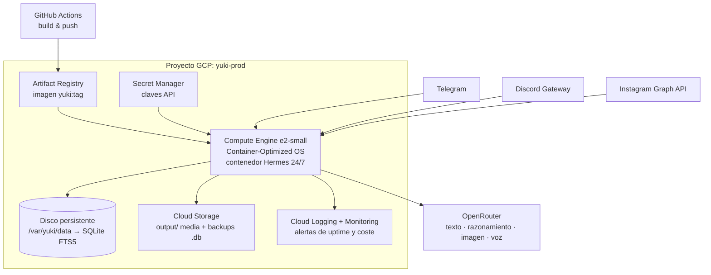

# 🏗️ Implementación de Infraestructura — Yuki

*Investigación técnica y plan de implementación: **OpenRouter** como proveedor multimodal y de modelos nucleares (razonamiento), **Google Cloud** como hogar del contenedor Hermes, y el inventario mínimo de cuentas del proyecto.*

> Estado: propuesta de arquitectura (no implementada todavía en código).
> Fecha de investigación: agosto 2026.
> Documentos relacionados: [`ARCHITECTURE.md`](ARCHITECTURE.md) · [`DEPLOYMENT_GUIDE.md`](DEPLOYMENT_GUIDE.md) · [`NOUS_PORTAL_TOOLS.md`](NOUS_PORTAL_TOOLS.md)

---

## 0. Resumen ejecutivo

| Decisión | Recomendación | Motivo principal |
|---|---|---|
| Proveedor de texto y razonamiento | **OpenRouter** como agregador único (ya declarado en `config.yaml`) | Una sola clave, una sola factura, failover automático entre proveedores, parámetro `reasoning` unificado |
| Proveedor de imagen | **OpenRouter Image API** (30+ modelos: Nano Banana 2 / Gemini Flash Image, Seedream 4.5, FLUX.2 Pro) | Sustituye la ruta directa a FAL.ai sin perder modelos; se factura por el mismo saldo |
| Proveedor de voz (TTS/STT) | **OpenRouter TTS/Transcripciones** como principal, `nous_tts_v2` como respaldo | Endpoints compatibles con OpenAI, salida MP3/PCM |
| Música (`suno_v4`, `flow_audio`) | **Fuera de OpenRouter** — se mantiene la pasarela Nous Portal / API directa | OpenRouter no expone catálogo de música generativa de larga duración |
| Alojamiento del contenedor Hermes | **Compute Engine `e2-small`** (o `e2-micro` Always Free) con Container-Optimized OS + disco persistente | SQLite FTS5 exige un sistema de ficheros POSIX real con bloqueo; Cloud Run no lo ofrece |
| Secretos | **Secret Manager** montado como variables de entorno | Elimina el `.env` en disco de producción |
| Coste objetivo | **≈ 0 – 22 USD/mes** de infraestructura + consumo variable de tokens | Ver §5 |

Regla de oro de la arquitectura: **OpenRouter es el núcleo cognitivo y multimodal; Google Cloud es el cuerpo que lo mantiene despierto 24/7.**

---

## 1. Investigación: OpenRouter como proveedor multimodal y nuclear

### 1.1 Qué cubre hoy OpenRouter

OpenRouter dejó de ser sólo un agregador de texto: expone una **API unificada por modalidad** bajo una misma clave y un mismo saldo.

| Modalidad | Superficie de API | Estado para Yuki |
|---|---|---|
| Texto / chat / razonamiento | `POST /api/v1/chat/completions` (compatible OpenAI) | ✅ Núcleo — ya previsto en `config.yaml` |
| Visión (imagen como *entrada*) | Mismo endpoint de chat, contenido multiparte | ✅ Análisis de referencias estéticas y moodboards |
| Generación de imagen | `POST /api/v1/images` + superficie compatible `/v1/images/generations` | ✅ Sustituye `fal-ai/flux-pro` directo |
| Generación de vídeo | endpoint `/videos` | 🟡 Explorar para *reels* de Instagram (fase 3) |
| TTS (voz sintética) | endpoint dedicado compatible OpenAI, salida MP3/PCM | ✅ Notas de voz (requiere transcodificado a OGG Opus con `ffmpeg`, ya presente en el `Dockerfile`) |
| STT (transcripción) | endpoint dedicado, respuesta JSON con texto y uso | ✅ Notas de voz entrantes de seguidores |
| Embeddings | endpoint dedicado | 🟡 Futuro híbrido BM25 + vectorial sobre `MEMORY.md` |
| Música generativa larga (Suno / Flow Audio) | ❌ No disponible | Se mantiene fuera del agregador |
| Documentos PDF como entrada | ✅ soportado | Útil para *briefs* del productor |

### 1.2 Modelos nucleares (razonamiento)

OpenRouter normaliza el control del *thinking* con un único objeto en el cuerpo de la petición:

```jsonc
{
  "model": "anthropic/claude-sonnet-4.5",
  "reasoning": { "effort": "high" },   // none | minimal | low | medium | high | xhigh
  "messages": [ /* ... */ ]
}
```

Puntos verificados en la investigación:

- Los niveles de esfuerzo son `none`, `minimal`, `low`, `medium`, `high`, `xhigh`.
- El mapeo es dependiente del proveedor: familias **OpenAI (serie o / GPT-5)** y **Grok** aceptan `effort` nativo; **Anthropic** y **Gemini 2.5** se traducen a presupuesto de tokens (`budget_tokens = max(min(max_tokens × ratio, 32000), 1024)`, con ratio 0.8/0.5/0.2/0.1 para high/medium/low/minimal); **Gemini 3** se mapea a `thinkingLevel`.
- ⚠️ **Riesgo documentado:** algunos modelos *descartan silenciosamente* los parámetros de razonamiento en lugar de devolver error, y enviar simultáneamente `reasoning` y `reasoning_effort` provoca `400` en ciertos modelos. → Yuki debe enviar **sólo** el objeto `reasoning` y **verificar** en la respuesta que `usage.reasoning_tokens > 0` antes de asumir que el modelo razonó.

### 1.3 Encaje con la configuración actual de Yuki

`config.yaml` y `hermes_config.yaml` ya declaran `aggregator: "openrouter"` con dos *tiers*. La propuesta consolida ese enrutado y le añade una **capa nuclear** explícita:

| Tier | Uso | Modelos sugeridos (prefijo `openrouter/`) | `reasoning` |
|---|---|---|---|
| `tier_0_reflex` | Moderación, formateo social, resúmenes de feed | `google/gemini-flash`, `deepseek/deepseek-chat` | `none` |
| `tier_1_creative` | Haiku matinal, copy de posts, letras | `anthropic/claude-sonnet-4.5` | `low` |
| `tier_2_nuclear` | Síntesis dialéctica Honcho, planificación de lanzamientos, reflexión nocturna de tendencias | `openai/gpt-5.x`, `google/gemini-3-pro`, `anthropic/claude-opus` | `high` / `xhigh` |
| `tier_media` | Portadas, avatares, *reels* | Nano Banana 2, Seedream 4.5, FLUX.2 Pro vía Image API | — |

Correspondencia con los bloques ya existentes en `config.yaml → nous_portal.frontier_engines`:

| Motor actual | Ruta propuesta |
|---|---|
| `vision.gemini_image` / `seedream` / `flux_pro` | → OpenRouter Image API (mismos modelos, una sola clave) |
| `voice.gemini_multimodal_audio` | → OpenRouter TTS (+ `ffmpeg` → OGG Opus) |
| `voice.nous_tts_v2` | → respaldo, sin cambios |
| `music.suno_v4` / `flow_audio` | → sin cambios, fuera de OpenRouter |
| `web_search.firecrawl` | → sin cambios (Firecrawl directo) |

### 1.4 Ventajas concretas para el proyecto

1. **Una clave, una factura.** `OPENROUTER_API_KEY` cubre texto, razonamiento, imagen, voz y transcripción. Reduce el inventario de cuentas (§4) y el riesgo operativo.
2. **Failover nativo.** El campo `models` (lista de respaldo) y el enrutado por proveedor evitan que una caída de un único proveedor apague a Yuki. Encaja con `fallback_model` ya presente en `config.yaml`.
3. **Sin recargo declarado sobre el precio del proveedor** en la Image API, y **las peticiones fallidas no se facturan** (*Zero Completion Insurance*).
4. **BYOK.** Si en el futuro se negocia tarifa directa con Anthropic o Google, las claves propias se enchufan sin reescribir el código de Yuki.
5. **Superficie compatible con OpenAI**, es decir: `openai-python` estándar cambiando `base_url`. Cero SDK propietario.

### 1.5 Riesgos y mitigaciones

| Riesgo | Impacto | Mitigación |
|---|---|---|
| Punto único de fallo (todo pasa por OpenRouter) | Alto | Mantener `ANTHROPIC_API_KEY`/`GEMINI_API_KEY` como ruta de emergencia en `hermes_config.yaml`; interruptor `provider_routing.aggregator` |
| Latencia extra del agregador | Bajo–medio | Usar `tier_0` para lo que es sensible a latencia (chat en vivo) y limitar la lista de proveedores por petición |
| Parámetros de razonamiento descartados en silencio | Medio | Validar `usage.reasoning_tokens` y registrar advertencia |
| Precios por modalidad heterogéneos (por imagen vs. por megapíxel) | Medio | Consultar `/api/v1/images/models/{id}/endpoints` antes de fijar el modelo por defecto; presupuesto mensual con alerta |
| Retención de datos según proveedor | Medio | Activar la política de privacidad/ZDR en la cuenta y excluir proveedores que entrenan con los datos; nunca enviar `MEMORY.md` completo (la memoria FTS5 ya envía sólo 5 fragmentos) |

---

## 2. Investigación: Google Cloud para el contenedor Hermes

### 2.1 El requisito que decide la arquitectura

Yuki persiste su memoria en **SQLite con FTS5** (`data/yuki_memory.db`) y escribe media en `output/`. SQLite necesita un sistema de ficheros **POSIX con bloqueo real y escrituras aleatorias**. Esto elimina de raíz la opción más "serverless":

- **Cloud Run + volumen Cloud Storage (GCS FUSE):** no es POSIX completo, **no ofrece bloqueo de ficheros** (el último escritor gana y los anteriores se pierden) y penaliza fuertemente las escrituras. Es viable para cargas de sólo lectura, **no para la base de datos viva de Yuki**.
- **Cloud Run sin volumen:** el sistema de ficheros es efímero → la memoria de Yuki se perdería en cada revisión o escalado.

### 2.2 Comparativa de opciones

| Opción | Persistencia SQLite | Coste aprox./mes | Complejidad | Veredicto |
|---|---|---|---|---|
| **GCE `e2-micro`** (us-west1/us-central1/us-east1) + disco persistente 30 GB | ✅ Nativa | **0 USD** dentro de *Always Free* (1 VM no interrumpible + 30 GB-mes de disco estándar + 1 GB de salida NA) | Baja | ✅ **Arranque recomendado** |
| **GCE `e2-small`** (2 GB RAM, región europea) | ✅ Nativa | ≈ 13–15 USD | Baja | ✅ **Producción recomendada** (latencia UE, margen de RAM para `ffmpeg`) |
| Cloud Run con `min-instances=1` y CPU siempre asignada | ❌ (efímero) | ≈ 10 USD o más con `--no-cpu-throttling` | Media | ⚠️ Sólo para el *webhook* sin estado |
| Cloud Run + Filestore (NFS) | ✅ | +≈ 200 USD (Filestore mínimo) | Alta | ❌ Desproporcionado |
| GKE Autopilot | ✅ | ≈ 70 USD+ | Alta | ❌ Sobreingeniería para <180 MB de RAM |

**Atención al *Always Free*:** el `e2-micro` gratuito **sólo** es gratis en `us-west1`, `us-central1` y `us-east1`. Desplegarlo en `europe-southwest1` factura tarifa completa. Como el `scheduler.timezone` de Yuki es `Europe/Madrid` pero sus tareas son cron (no interactivas), la latencia transatlántica es irrelevante para el daemon; sólo importa para los webhooks de Telegram/Discord (≈ +100 ms, aceptable).

### 2.3 Arquitectura propuesta en Google Cloud



**Componentes y su papel:**

| Servicio | Uso en Yuki | Coste |
|---|---|---|
| **Compute Engine** | VM con Container-Optimized OS ejecutando `docker-compose.yml` tal cual | 0–15 USD |
| **Disco persistente balanceado 20–30 GB** | `data/` (SQLite) montado en `/var/yuki/data` | incluido / ≈ 2 USD |
| **Artifact Registry** | Registro privado de la imagen del `Dockerfile` (<150 MB) | ≈ 0.10 USD/GB (gratis hasta 0.5 GB) |
| **Secret Manager** | Todas las claves de `.env.example`; se inyectan al arrancar el contenedor | ≈ 0.06 USD/secreto-mes + accesos |
| **Cloud Storage** | Espejo de `output/art|voice|music|posts` + copia diaria de `yuki_memory.db` | céntimos |
| **Snapshots programados de disco** | Copia diaria/semanal del disco completo | céntimos |
| **Cloud Logging / Monitoring** | Logs de `cli.py run-daemon`, alerta de uptime y **presupuesto con alerta al 50/90/100 %** | gratis hasta el nivel free |
| **Cloud Scheduler** *(opcional)* | Redundancia externa al cron interno (`src/scheduler/cron_engine.py`) si se prefiere disparo HTTP | 3 jobs gratis/mes |

### 2.4 Detalle operativo

- **Cron interno vs. Cloud Scheduler.** Yuki ya tiene su motor (`nocturnal_trend_reflection` 03:00, `morning_inspiration_drop` 07:30, `daily_memory_synthesis` 23:30). Se mantiene el cron interno como fuente de verdad (menos piezas móviles); Cloud Scheduler sólo se añade si se quiere que las tareas sobrevivan a un daemon caído.
- **Webhook de Telegram.** Requiere HTTPS público. Dos rutas: (a) IP estática de la VM + Caddy con TLS automático sobre un subdominio, o (b) modo *long polling* (`adapters.telegram.poll_mode: polling`) y ningún puerto abierto — más simple y suficiente para el volumen de Yuki. **Recomendado (b) en fase 1.**
- **Discord** usa WebSocket saliente (Gateway): no necesita entrada, funciona detrás de NAT sin abrir puertos.
- **Firewall:** sin reglas de entrada salvo SSH vía IAP (`35.235.240.0/20`). Nada de `0.0.0.0/0:22`.
- **Identidad:** una cuenta de servicio dedicada `yuki-runtime@` con `secretmanager.secretAccessor`, `storage.objectAdmin` sobre un único bucket y `logging.logWriter`. Nunca la cuenta por defecto de Compute con *scope* `cloud-platform`.
- **Actualizaciones:** `docker compose pull && docker compose up -d` disparado por GitHub Actions vía SSH IAP, o simplemente manual. La imagen queda versionada en Artifact Registry.

---

## 3. Plan de implementación por fases

### Fase 1 — Cimientos (día 1–2)
1. Crear proyecto GCP `yuki-prod` con cuenta de facturación y **presupuesto con alertas**.
2. Habilitar APIs: `compute`, `artifactregistry`, `secretmanager`, `storage`, `logging`, `monitoring`, `iap`.
3. Crear cuenta de servicio `yuki-runtime` con los tres roles mínimos.
4. Subir a Secret Manager las claves de `.env.example`.
5. Crear la VM (`e2-micro` en `us-central1` para validar coste cero, o `e2-small` en `europe-southwest1`) + disco persistente para `data/`.
6. `docker compose up -d` con la imagen actual → validar `python3 cli.py chat` y `memory-benchmark` dentro del contenedor.

### Fase 2 — Consolidación en OpenRouter (día 3–5)
1. Añadir un cliente único `src/tools/openrouter_client.py` compatible con OpenAI (`base_url=https://openrouter.ai/api/v1`) con cabeceras `HTTP-Referer` y `X-Title` para atribución.
2. Extender `provider_routing` de `config.yaml` con el `tier_2_nuclear` y el bloque `reasoning` por ruta.
3. Migrar `src/tools/media_creator.py` de FAL directo a la Image API, dejando FAL como respaldo por bandera de configuración.
4. Migrar TTS a la ruta OpenRouter + transcodificado `ffmpeg -c:a libopus` para las notas de voz.
5. Añadir registro de coste por petición (`usage` de cada respuesta) en la tabla de memoria, para vigilar el gasto por tarea autónoma.

### Fase 3 — Presencia social y resiliencia (semana 2–4)
1. Alta y verificación de las cuentas de §4 (Meta es el camino crítico: 2–4 semanas de revisión).
2. Adaptador de Instagram (contenedor de media → publicación) reutilizando `output/art`.
3. Backups: `sqlite3 .backup` diario a Cloud Storage + snapshots de disco.
4. Alerta de *uptime* y panel de Monitoring (RAM < 180 MB, latencia de memoria < 150 ms).
5. Evaluar la Video API de OpenRouter para *reels*.

---

## 4. Cuentas mínimas necesarias para el proyecto

### 4.1 Imprescindibles (bloquean el despliegue)

| # | Cuenta | Para qué | Requisitos y notas | Coste |
|---|---|---|---|---|
| 1 | **Correo dedicado del proyecto** (p. ej. Google Workspace o Gmail propio de Yuki) | Titularidad de todas las demás altas; evita atar la identidad del proyecto a una cuenta personal | Activar 2FA con app TOTP, no SMS | 0–6 USD/mes |
| 2 | **Google Cloud** (proyecto + cuenta de facturación) | VM, Artifact Registry, Secret Manager, Storage, Logging | Tarjeta obligatoria incluso para *Always Free* | 0–15 USD/mes |
| 3 | **OpenRouter** | Texto, razonamiento, imagen, voz, transcripción | Saldo prepago; crear **claves separadas** para `dev` y `prod` con límite de gasto por clave | consumo |
| 4 | **GitHub** | Repositorio y CI/CD de la imagen | El repo ya existe | 0 |
| 5 | **Telegram — BotFather** | Bot de Yuki (`TELEGRAM_BOT_TOKEN`) | Requiere un número de teléfono | 0 |
| 6 | **Discord Developer Portal** | Aplicación + bot (`DISCORD_BOT_TOKEN`), intents de mensajes | Cuenta de Discord verificada por correo; para >100 servidores exige verificación del bot | 0 |
| 7 | **Honcho** | Modelado dialéctico (`HONCHO_API_KEY`, app `yuki-digital-diva`) | Ya referenciado en `config.yaml` | según plan |

### 4.2 Necesarias para la presencia pública

| # | Cuenta | Para qué | Requisitos críticos | Coste |
|---|---|---|---|---|
| 8 | **Instagram Profesional (Business)** | Publicar arte y *reels* de Yuki | **Business, no Creator**: las cuentas Creator no admiten publicación por API | 0 |
| 9 | **Página de Facebook** | Vínculo obligatorio de la cuenta de Instagram Business | Se puede crear vacía, pero es obligatoria | 0 |
| 10 | **Meta Business + app de desarrollador** | `instagram_business_basic` + `instagram_business_content_publish` | Los *scopes* antiguos (`instagram_basic`, `instagram_content_publish`) están retirados desde el 27/01/2025. **Si Yuki publica sólo en su propia cuenta, basta con la app en modo desarrollo añadiendo la cuenta como *Instagram Tester* — sin App Review.** El acceso avanzado (cuentas de terceros) exige revisión + verificación de empresa: **2–4 semanas** | 0 |
| 11 | **Dominio propio** (p. ej. `yuki.art`) | Correo de marca, webhooks con TLS, enlaces de lanzamiento | Sólo necesario si se opta por webhook en lugar de *polling* | ≈ 10–15 USD/año |
| 12 | **Cloudflare** *(opcional)* | DNS, proxy y TLS del subdominio del webhook | Plan gratuito suficiente | 0 |

### 4.3 Opcionales según el alcance creativo

| # | Cuenta | Para qué | Nota |
|---|---|---|---|
| 13 | **Nous Portal** | Pasarela unificada ya integrada (`nous_portal.py`); respaldo de TTS | Se conserva mientras cubra música/voz |
| 14 | **Suno** (`suno_v4`) | Música generativa completa | No cubierto por OpenRouter |
| 15 | **FAL.ai** (`FAL_KEY`) | Respaldo de imagen si cae la Image API | Mantener la clave aunque la ruta principal sea OpenRouter |
| 16 | **Firecrawl** (`FIRECRAWL_API_KEY`) | Rastreo de tendencias (`web_search`) | Ya en `.env.example` |
| 17 | **Anthropic / Google AI Studio** | Claves directas de emergencia (BYOK o *bypass* del agregador) | Ya en `hermes_config.yaml` |
| 18 | **Plataformas de distribución musical** (DistroKid, Bandcamp, Spotify for Artists) | Publicación de sencillos de Yuki | Fuera del alcance de infraestructura |
| 19 | **Gestor de contraseñas de equipo** (1Password / Bitwarden) | Custodia de las credenciales de todas las cuentas anteriores | Recomendado desde el día 1 |

### 4.4 Reglas de higiene para las cuentas

- Todas las cuentas se dan de alta con el **correo del proyecto** (#1), nunca con el personal del productor.
- **2FA obligatorio** en Google Cloud, GitHub, Meta, Discord y OpenRouter; códigos de recuperación guardados en el gestor de contraseñas.
- **Una clave por entorno** (`dev` / `prod`) y por servicio, con límite de gasto donde el proveedor lo permita.
- En producción **no existe fichero `.env`**: las variables llegan desde Secret Manager al arrancar el contenedor.
- Rotación de claves cada 90 días y de forma inmediata ante cualquier sospecha de filtración.
- El fichero real `.env` está en `.gitignore`; sólo se versiona `.env.example`.

---

## 5. Coste estimado mensual

| Partida | Escenario mínimo | Escenario producción UE |
|---|---|---|
| Compute Engine | 0 USD (`e2-micro` Always Free, us-central1) | ≈ 13–15 USD (`e2-small`, europe-southwest1) |
| Disco persistente + snapshots | 0 USD (30 GB free) | ≈ 2–3 USD |
| Artifact Registry + Secret Manager + Logging | ≈ 0–1 USD | ≈ 1–2 USD |
| Cloud Storage (media y backups) | < 1 USD | ≈ 1 USD |
| **Subtotal infraestructura** | **≈ 0–2 USD** | **≈ 17–21 USD** |
| OpenRouter — texto/razonamiento (3 tareas cron + chat) | variable, típicamente 5–20 USD | 20–60 USD |
| OpenRouter — imagen (≈ 30 portadas/mes a ≈ 0.04 USD) | ≈ 1–2 USD | ≈ 3–5 USD |
| OpenRouter — TTS | ≈ 1–3 USD | ≈ 5 USD |
| Honcho / Firecrawl / Suno | según plan | según plan |

> Las cifras de infraestructura son estimaciones a partir de las tarifas públicas consultadas en agosto de 2026; confírmalas en la calculadora de Google Cloud antes de comprometer presupuesto. El gasto en modelos depende por completo del volumen real de interacción.

---

## 6. Seguridad, respaldo y observabilidad

| Ámbito | Medida |
|---|---|
| Secretos | Secret Manager + cuenta de servicio con `secretAccessor`; prohibido `.env` en la VM |
| Acceso a la VM | SSH exclusivamente por IAP; sin IP pública de entrada; sin claves SSH en el proyecto |
| Red | Sin reglas de ingreso salvo IAP; Discord y Telegram funcionan con conexiones salientes |
| Datos | `sqlite3 data/yuki_memory.db ".backup"` diario → Cloud Storage con versionado + snapshots de disco semanales |
| Restauración | Procedimiento probado: nueva VM + adjuntar snapshot + `docker compose up -d` (objetivo: < 15 min) |
| Privacidad del modelo | Política de datos de OpenRouter configurada para excluir proveedores que entrenan con las peticiones; la memoria FTS5 envía como máximo 5 fragmentos, nunca `MEMORY.md` completo |
| Coste | Presupuesto de facturación con alertas al 50/90/100 % y límite de gasto por clave de OpenRouter |
| Salud | Comprobación de *uptime* + alerta si el daemon deja de escribir logs o si la RAM supera los 300 MB |
| Contenido | Registro de todo lo publicado en `output/posts` para auditoría; ninguna publicación automática en Instagram sin la revisión del productor durante las primeras semanas |

---

## 7. Apéndice — Comandos de referencia

### 7.1 Provisión mínima en Google Cloud

```bash
export PROJECT=yuki-prod ZONE=us-central1-a REGION=us-central1

gcloud config set project "$PROJECT"
gcloud services enable compute.googleapis.com artifactregistry.googleapis.com \
  secretmanager.googleapis.com storage.googleapis.com iap.googleapis.com

# Registro de imágenes
gcloud artifacts repositories create yuki --repository-format=docker --location="$REGION"

# Identidad de ejecución
gcloud iam service-accounts create yuki-runtime --display-name="Yuki runtime"
gcloud projects add-iam-policy-binding "$PROJECT" \
  --member="serviceAccount:yuki-runtime@$PROJECT.iam.gserviceaccount.com" \
  --role="roles/secretmanager.secretAccessor"

# Secretos (uno por clave de .env.example)
printf '%s' "$OPENROUTER_API_KEY" | gcloud secrets create OPENROUTER_API_KEY --data-file=-

# Disco persistente para la memoria SQLite
gcloud compute disks create yuki-data --size=20GB --type=pd-balanced --zone="$ZONE"

# VM con Container-Optimized OS (e2-micro = Always Free en us-central1)
gcloud compute instances create yuki-agent \
  --zone="$ZONE" --machine-type=e2-micro \
  --image-family=cos-stable --image-project=cos-cloud \
  --disk=name=yuki-data,device-name=yuki-data,mode=rw \
  --service-account="yuki-runtime@$PROJECT.iam.gserviceaccount.com" \
  --scopes=https://www.googleapis.com/auth/cloud-platform \
  --no-address --shielded-secure-boot

# Acceso sin IP pública
gcloud compute ssh yuki-agent --zone="$ZONE" --tunnel-through-iap
```

### 7.2 Llamada nuclear (razonamiento) vía OpenRouter

```python
from openai import OpenAI

client = OpenAI(
    base_url="https://openrouter.ai/api/v1",
    api_key=os.environ["OPENROUTER_API_KEY"],
    default_headers={"HTTP-Referer": "https://yuki.art", "X-Title": "Yuki Digital Diva"},
)

resp = client.chat.completions.create(
    model="anthropic/claude-sonnet-4.5",
    extra_body={
        "reasoning": {"effort": "high"},          # nunca junto con reasoning_effort
        "models": ["google/gemini-3-pro", "openai/gpt-5.1"],  # cadena de failover
    },
    messages=[{"role": "system", "content": soul_prompt},
              {"role": "user", "content": brief}],
    max_tokens=1500,
)

# Verificar que el modelo realmente razonó (algunos lo descartan en silencio)
usage = resp.usage
if not getattr(usage, "reasoning_tokens", 0):
    log.warning("El modelo %s ignoró el parámetro reasoning", resp.model)
```

### 7.3 Generación de portada (Image API)

```bash
curl https://openrouter.ai/api/v1/images \
  -H "Authorization: Bearer $OPENROUTER_API_KEY" \
  -H "Content-Type: application/json" \
  -d '{
        "model": "google/gemini-flash-image",
        "prompt": "portada de sencillo, invierno industrial coreano, tinta y nieve, kado minimalista",
        "n": 1
      }'
```

Antes de fijar un modelo por defecto, consultar su tarifa y sus parámetros reales:

```bash
curl -s "https://openrouter.ai/api/v1/images/models/google%2Fgemini-flash-image/endpoints" \
  -H "Authorization: Bearer $OPENROUTER_API_KEY" | jq '.data.endpoints[] | {provider, pricing}'
```

---

## 8. Decisiones pendientes de confirmar por el productor

1. **Región:** ¿coste cero en EE. UU. (`e2-micro` Always Free) o latencia europea pagando ≈ 15 USD/mes?
2. **Telegram:** ¿*long polling* (sin dominio ni puertos) o webhook con dominio propio y TLS?
3. **Instagram:** ¿publicación sólo en la cuenta de Yuki (modo desarrollo, sin App Review) o soporte para cuentas de terceros (revisión de 2–4 semanas)?
4. **Música:** ¿se mantiene Suno/Nous Portal, o se limita la fase 1 a MIDI propio (`src/tools/midi_generator.py`) más imagen y voz?
5. **Presupuesto mensual máximo** de tokens, para dimensionar el reparto entre `tier_0` y `tier_2_nuclear`.

---

## Fuentes consultadas

- [OpenRouter — Multimodal overview](https://openrouter.ai/docs/guides/overview/multimodal/overview)
- [OpenRouter — Introducing the Unified Image API](https://openrouter.ai/blog/announcements/image-api/)
- [OpenRouter — One API for Image, Video, Audio, Embeddings & Transcription](https://openrouter.ai/blog/insights/every-modality-one-api/)
- [OpenRouter — Image Generation docs](https://openrouter.ai/docs/guides/overview/multimodal/image-generation)
- [OpenRouter — Reasoning Tokens](https://openrouter.ai/docs/guides/best-practices/reasoning-tokens)
- [OpenRouter — Audio models collection](https://openrouter.ai/collections/audio-models)
- [Google Cloud — Cloud Run pricing](https://cloud.google.com/run/pricing)
- [Google Cloud — Configure Cloud Storage volume mounts for Cloud Run services](https://docs.cloud.google.com/run/docs/configuring/services/cloud-storage-volume-mounts)
- [Google Cloud — Compute Engine free tier](https://cloud.google.com/free/docs/compute-getting-started)
- [Meta — Publish Content using the Instagram Platform](https://developers.facebook.com/docs/instagram-platform/content-publishing/)
- [Instagram API Integration Guide 2026 (Phyllo)](https://www.getphyllo.com/post/instagram-api-integration-101-for-developers-of-the-creator-economy)
