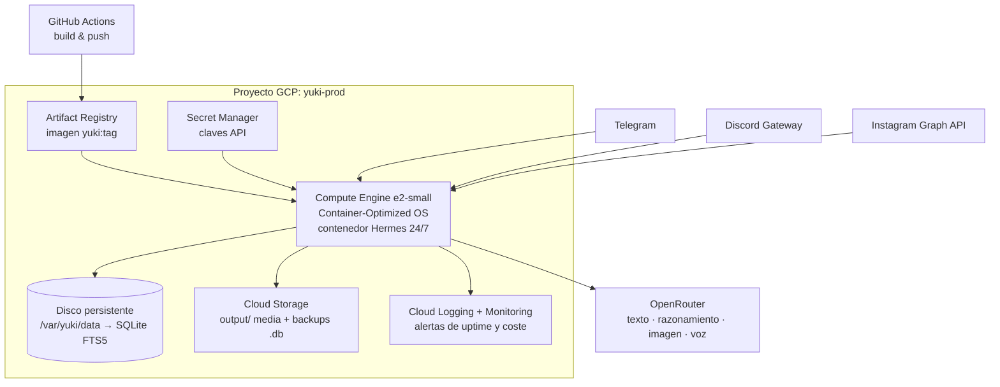

# 🏗️ Implementación de Infraestructura — Yuki

*Propuesta de infraestructura para Yuki: **Nous Portal** como pasarela única de modelos y herramientas, **OpenRouter** como respaldo y capa de razonamiento nuclear, **Google Cloud** como hogar del contenedor Hermes, y el inventario mínimo de cuentas del proyecto.*

> **Estado: propuesta cerrada (v1.0) — lista para ejecutar.**
> Las decisiones de §0 se dan por tomadas y son la base del plan de §3. Los tres supuestos que aún dependen del productor (región, música y presupuesto) están fijados con un valor por defecto reversible en §8. La revisión final añadió los detalles operativos de §2.4 y el bloque de cumplimiento de §6.bis; la lista de verificación de cierre está en §9.
> Fecha de investigación: agosto 2026 · Documentos relacionados: [`ARCHITECTURE.md`](ARCHITECTURE.md) · [`DEPLOYMENT_GUIDE.md`](DEPLOYMENT_GUIDE.md) · [`NOUS_PORTAL_TOOLS.md`](NOUS_PORTAL_TOOLS.md)

---

## 0. Propuesta adoptada

| # | Decisión | Qué se adopta | Motivo | Alternativa descartada |
|---|---|---|---|---|
| **D-1** | Pasarela principal | **Nous Portal, plan Plus (20 USD/mes)** | Vía nativa de Hermes Agent: un solo OAuth y un solo saldo cubren modelos + Tool Gateway (búsqueda, imagen, vídeo, voz, navegador, sandbox). Reduce el inventario de cuentas de ~12 a 8 (§1.bis) | OpenRouter puro: obliga a mantener FAL, Firecrawl y TTS por separado |
| **D-2** | Respaldo cognitivo | **OpenRouter en `fallback_providers`** | Failover nativo de Hermes ante caída del Portal o agotamiento de créditos; catálogo más amplio y control fino de enrutado (`provider_routing`) | Pasarela única: punto único de fallo inaceptable para un agente 24/7 |
| **D-3** | Modelos nucleares (razonamiento) | **Tier `tier_2_nuclear` con `reasoning.effort: high`** para síntesis dialéctica Honcho, reflexión nocturna y planificación de lanzamientos | Objeto `reasoning` unificado, con validación de `usage.reasoning_tokens` porque algunos modelos lo descartan en silencio (§1.2) | Un único modelo para todo: caro en tareas triviales, corto en las profundas |
| **D-4** | Imagen y vídeo | **Tool Gateway (FAL)**, con OpenRouter Image API como respaldo | Catálogos casi idénticos; elimina la clave `FAL_KEY` propia | FAL directo: una cuenta y una factura más sin ventaja |
| **D-5** | Voz (TTS/STT) | **Tool Gateway (OpenAI TTS + Whisper)** + transcodificado `ffmpeg` a OGG Opus | Incluido en la suscripción; salida compatible con las notas de voz de Telegram | ElevenLabs: calidad superior, coste y cuenta adicionales no justificados en fase 1 |
| **D-6** | Música | **MIDI propio (`src/tools/midi_generator.py`) en fase 1**; Suno se pospone | Ni el Tool Gateway ni OpenRouter cubren música generativa cantada (§1.bis.2). Los motores `suno_v4` y `flow_audio` del repo son *mocks* | Contratar Suno ya: se difiere hasta que haya un lanzamiento real que lo exija (§8, S-2) |
| **D-7** | Alojamiento del contenedor Hermes | **Compute Engine `e2-micro`** (Always Free, `us-central1`) con Container-Optimized OS + disco persistente | SQLite FTS5 exige sistema de ficheros POSIX con bloqueo real; arranque a coste cero y ruta de crecimiento directa a `e2-small` en Europa | Cloud Run (GCS FUSE no ofrece bloqueo → corrupción de la memoria) y Hermes Cloud (en preview, no ejecuta la imagen propia de Yuki, §2.5) |
| **D-8** | Secretos e identidad | **Secret Manager** + cuenta de servicio `yuki-runtime` con tres roles mínimos; SSH sólo por IAP | Elimina el `.env` del disco de producción y la VM de la Internet pública | `.env` en la VM: filtración a un `docker inspect` de distancia |
| **D-9** | Ingesta de mensajes | **Telegram en *long polling*** y Discord por WebSocket saliente | Sin dominio, sin TLS y sin puertos abiertos en fase 1 | Webhook con dominio propio: se difiere a la fase 3 si el volumen lo pide |
| **D-10** | Presupuesto | **Portal Plus + tope de gasto en OpenRouter + alerta de facturación GCP al 50/90/100 %** | Techo de coste conocido: ≈ 20–25 USD/mes todo incluido en el escenario de arranque | Sin topes: riesgo de factura sorpresa por un bucle de cron |

Regla de oro de la arquitectura: **Nous Portal es el núcleo cognitivo y multimodal, con OpenRouter detrás como red de seguridad; Google Cloud es el cuerpo que mantiene a Yuki despierta 24/7.**

> ⚠️ **Matiz importante sobre "suscripción única":** la suscripción de Nous Portal unifica el *acceso y la facturación*, no es tarifa plana. Cada llamada a un modelo y cada uso de herramienta descuenta del saldo mensual de créditos del plan. Detalle en §1.bis.

---

## 1. Investigación: OpenRouter como proveedor multimodal y nuclear (rol auxiliar)

> Esta sección es la investigación que sustenta D-2 y D-3. Tras comparar con Nous Portal (§1.bis), OpenRouter queda como **respaldo cognitivo y ruta de escape**, no como pasarela principal. Los *tiers* y el control de razonamiento de §1.2 y §1.3 se aplican igual sea cual sea la pasarela que atienda la petición.

### 1.1 Qué cubre hoy OpenRouter

OpenRouter dejó de ser sólo un agregador de texto: expone una **API unificada por modalidad** bajo una misma clave y un mismo saldo.

| Modalidad | Superficie de API | Estado para Yuki |
|---|---|---|
| Texto / chat / razonamiento | `POST /api/v1/chat/completions` (compatible OpenAI) | ✅ Núcleo — ya previsto en `config.yaml` |
| Visión (imagen como *entrada*) | Mismo endpoint de chat, contenido multiparte | ✅ Análisis de referencias estéticas y moodboards |
| Generación de imagen | `POST /api/v1/images` + superficie compatible `/v1/images/generations` | ✅ Sustituye `fal-ai/flux-pro` directo |
| Generación de vídeo | endpoint `/videos` | 🟡 Explorar para *reels* de Instagram (fase 3) |
| TTS (voz sintética) | endpoint dedicado compatible OpenAI, salida MP3/PCM | ✅ Notas de voz (requiere transcodificado a OGG Opus con `ffmpeg`, ya presente en el `Dockerfile`) |
| STT (transcripción) | endpoint dedicado, respuesta JSON con texto y uso | ✅ Notas de voz entrantes de seguidores |
| Embeddings | endpoint dedicado | 🟡 Futuro híbrido BM25 + vectorial sobre `MEMORY.md` |
| Música generativa larga (Suno / Flow Audio) | ❌ No disponible | Se mantiene fuera del agregador |
| Documentos PDF como entrada | ✅ soportado | Útil para *briefs* del productor |

### 1.2 Modelos nucleares (razonamiento)

OpenRouter normaliza el control del *thinking* con un único objeto en el cuerpo de la petición:

```jsonc
{
  "model": "anthropic/claude-sonnet-4.5",
  "reasoning": { "effort": "high" },   // none | minimal | low | medium | high | xhigh
  "messages": [ /* ... */ ]
}
```

Puntos verificados en la investigación:

- Los niveles de esfuerzo son `none`, `minimal`, `low`, `medium`, `high`, `xhigh`.
- El mapeo es dependiente del proveedor: familias **OpenAI (serie o / GPT-5)** y **Grok** aceptan `effort` nativo; **Anthropic** y **Gemini 2.5** se traducen a presupuesto de tokens (`budget_tokens = max(min(max_tokens × ratio, 32000), 1024)`, con ratio 0.8/0.5/0.2/0.1 para high/medium/low/minimal); **Gemini 3** se mapea a `thinkingLevel`.
- ⚠️ **Riesgo documentado:** algunos modelos *descartan silenciosamente* los parámetros de razonamiento en lugar de devolver error, y enviar simultáneamente `reasoning` y `reasoning_effort` provoca `400` en ciertos modelos. → Yuki debe enviar **sólo** el objeto `reasoning` y **verificar** en la respuesta que `usage.reasoning_tokens > 0` antes de asumir que el modelo razonó.

### 1.3 Encaje con la configuración actual de Yuki

`config.yaml` y `hermes_config.yaml` ya declaran `aggregator: "openrouter"` con dos *tiers*. La propuesta consolida ese enrutado y le añade una **capa nuclear** explícita:

| Tier | Uso | Modelos sugeridos (prefijo `openrouter/`) | `reasoning` |
|---|---|---|---|
| `tier_0_reflex` | Moderación, formateo social, resúmenes de feed | `google/gemini-flash`, `deepseek/deepseek-chat` | `none` |
| `tier_1_creative` | Haiku matinal, copy de posts, letras | `anthropic/claude-sonnet-4.5` | `low` |
| `tier_2_nuclear` | Síntesis dialéctica Honcho, planificación de lanzamientos, reflexión nocturna de tendencias | `openai/gpt-5.x`, `google/gemini-3-pro`, `anthropic/claude-opus` | `high` / `xhigh` |
| `tier_media` | Portadas, avatares, *reels* | Nano Banana 2, Seedream 4.5, FLUX.2 Pro vía Image API | — |

Correspondencia con los bloques ya existentes en `config.yaml → nous_portal.frontier_engines`:

| Motor actual | Ruta propuesta |
|---|---|
| `vision.gemini_image` / `seedream` / `flux_pro` | → OpenRouter Image API (mismos modelos, una sola clave) |
| `voice.gemini_multimodal_audio` | → OpenRouter TTS (+ `ffmpeg` → OGG Opus) |
| `voice.nous_tts_v2` | → respaldo, sin cambios |
| `music.suno_v4` / `flow_audio` | → sin cambios, fuera de OpenRouter |
| `web_search.firecrawl` | → sin cambios (Firecrawl directo) |

### 1.4 Ventajas concretas para el proyecto

1. **Una clave, una factura.** `OPENROUTER_API_KEY` cubre texto, razonamiento, imagen, voz y transcripción. Reduce el inventario de cuentas (§4) y el riesgo operativo.
2. **Failover nativo.** El campo `models` (lista de respaldo) y el enrutado por proveedor evitan que una caída de un único proveedor apague a Yuki. Encaja con `fallback_model` ya presente en `config.yaml`.
3. **Sin recargo declarado sobre el precio del proveedor** en la Image API, y **las peticiones fallidas no se facturan** (*Zero Completion Insurance*).
4. **BYOK.** Si en el futuro se negocia tarifa directa con Anthropic o Google, las claves propias se enchufan sin reescribir el código de Yuki.
5. **Superficie compatible con OpenAI**, es decir: `openai-python` estándar cambiando `base_url`. Cero SDK propietario.

### 1.5 Riesgos y mitigaciones

| Riesgo | Impacto | Mitigación |
|---|---|---|
| Punto único de fallo (todo pasa por OpenRouter) | Alto | Mantener `ANTHROPIC_API_KEY`/`GEMINI_API_KEY` como ruta de emergencia en `hermes_config.yaml`; interruptor `provider_routing.aggregator` |
| Latencia extra del agregador | Bajo–medio | Usar `tier_0` para lo que es sensible a latencia (chat en vivo) y limitar la lista de proveedores por petición |
| Parámetros de razonamiento descartados en silencio | Medio | Validar `usage.reasoning_tokens` y registrar advertencia |
| Precios por modalidad heterogéneos (por imagen vs. por megapíxel) | Medio | Consultar `/api/v1/images/models/{id}/endpoints` antes de fijar el modelo por defecto; presupuesto mensual con alerta |
| Retención de datos según proveedor | Medio | Activar la política de privacidad/ZDR en la cuenta y excluir proveedores que entrenan con los datos; nunca enviar `MEMORY.md` completo (la memoria FTS5 ya envía sólo 5 fragmentos) |

---

## 1.bis. Nous Portal: ¿una sola suscripción para todas las herramientas?

**Respuesta corta: sí.** Nous Portal es la pasarela oficial de Nous Research y la vía recomendada para ejecutar Hermes Agent —el arnés sobre el que está construida Yuki—. Con **un único OAuth y una única suscripción** se obtiene acceso al catálogo de modelos (300+ según la documentación oficial) **y** al *Tool Gateway*, sin dar de alta ni pagar por separado ninguna de las herramientas.

### 1.bis.1 Qué incluye el Tool Gateway

| Herramienta | Backend gestionado | Sustituye a | Uso en Yuki |
|---|---|---|---|
| Búsqueda y extracción web | **Firecrawl** | `FIRECRAWL_API_KEY` propia | `src/tools/web_search.py`, reflexión nocturna de tendencias |
| Generación de imagen | **FAL** (FLUX 2 Pro, Nano Banana Pro, Ideogram v3, Recraft v4, Qwen Image…) | `FAL_KEY` propia | Portadas y arte de `output/art` |
| Generación de vídeo | **FAL** (Veo 3.1, Kling v3, Seedance 2.0, PixVerse v6, LTX-2) | — | *Reels* de Instagram (fase 3) |
| Voz: TTS y transcripción | **OpenAI** (TTS + Whisper) | `ELEVENLABS_API_KEY` / TTS propio | Notas de voz de `output/voice` |
| Automatización de navegador | **Browser Use** (Chromium headless) | Cuenta de Browserbase | Publicación en plataformas sin API pública |
| Sandbox de código / terminal | **Modal** | Cuenta de Modal propia | Ejecución aislada; sustituiría a `src/serverless/modal_app.py` |
| Hospedaje del agente | **Hermes Cloud** (en *preview*) | VPS / Compute Engine | Ver §2.5 |

Es decir: de las cuentas opcionales listadas en §4.3, el Portal absorbe **Firecrawl, FAL, TTS, Browserbase y Modal**.

### 1.bis.2 Lo que la suscripción **no** es

Esto es lo que hay que tener claro antes de decidir:

- **No es tarifa plana.** Los planes publicados son **Free (0 USD)**, **Plus (20 USD/mes)**, **Super (100 USD/mes)** y **Ultra (200 USD/mes)**. Plus incluye ≈ 22 USD de créditos mensuales (tope de acumulación ≈ 10 USD) y Super ≈ 110 USD (tope ≈ 50 USD).
- **Modelos y herramientas comparten el mismo saldo.** Cada imagen (≈ 0.005–0.26 USD), cada minuto de Whisper (≈ 0.0063 USD), cada búsqueda y cada token de razonamiento descuentan de esos créditos. La ventaja es *una sola factura y una sola clave*, no consumo ilimitado.
- **El Tool Gateway es beneficio de plan de pago.** El nivel gratuito sirve para probar, no para operar a Yuki 24/7.
- **La música generativa larga sigue sin estar cubierta.** El Tool Gateway ofrece imagen, vídeo y voz, pero **no Suno ni Flow Audio**. ⚠️ Los motores `suno_v4` y `flow_audio` que `docs/NOUS_PORTAL_TOOLS.md` y `src/tools/nous_portal.py` describen como parte de la pasarela **no corresponden al catálogo real del Tool Gateway**: hoy son *mocks*. Si la música cantada es un requisito, exige una cuenta de Suno aparte (§4.3).

### 1.bis.3 Configuración por herramienta

El Portal se configura **por categoría**, así que se puede adoptar parcialmente: por ejemplo, imagen y búsqueda por el Portal, pero el razonamiento por OpenRouter.

```bash
hermes setup --portal     # OAuth; guarda el refresh token en ~/.hermes/auth.json
hermes tools              # selector por categoría: Fal, Firecrawl, OpenAI TTS, Browser Use…
```

```yaml
# ~/.hermes/config.yaml
model:
  provider: nous
  default: anthropic/claude-sonnet-4.6
  base_url: https://inference-api.nousresearch.com/v1

web:
  backend: nous           # Firecrawl gestionado
image_gen:
  provider: nous          # FAL gestionado
speech:
  provider: nous          # OpenAI TTS + Whisper

# Respaldo nativo de Hermes si el Portal falla o se agota el saldo
fallback_providers:
  - provider: openrouter
    model: anthropic/claude-sonnet-4.5
  - provider: anthropic
    model: claude-sonnet-4-6
```

Esto encaja con `hermes_config.yaml`, que ya declara `tools.gateway: "nous_portal"`. El cambio real es sustituir la `base_url` inventada `https://api.nousportal.com/v1` por la oficial `https://inference-api.nousresearch.com/v1` y pasar de clave estática a OAuth.

### 1.bis.4 Nous Portal vs. OpenRouter para Yuki

| Criterio | Nous Portal | OpenRouter |
|---|---|---|
| Alta y credenciales | Un OAuth, cero claves por herramienta | Una clave API, herramientas de medios en la misma API pero sin navegador ni sandbox |
| Herramientas incluidas | Búsqueda, imagen, vídeo, voz, navegador, sandbox, hosting | Imagen, vídeo, voz, transcripción, embeddings (sin navegador ni sandbox) |
| Integración con Hermes | Nativa y recomendada (`provider: nous`) | De primera clase (`OPENROUTER_API_KEY`) |
| Modelo de pago | Suscripción con créditos incluidos y tope de acumulación | Prepago puro, sin cuota fija |
| Control fino de enrutado | Limitado al catálogo curado | `provider_routing` (`sort`, `only`, `data_collection: deny`) |
| Riesgo | Créditos que caducan si Yuki consume poco | Sin cuota, pero saldo que hay que recargar |

**Recomendación para Yuki:** empezar en **Portal Plus (20 USD/mes)** como pasarela principal —cubre modelos, Firecrawl, FAL y TTS con una sola alta— y dejar **OpenRouter configurado como `fallback_providers`** para el `tier_2_nuclear` y para cuando haga falta un modelo fuera del catálogo curado. Es la combinación que minimiza cuentas sin crear un punto único de fallo. Si el consumo mensual real supera con holgura los 22 USD de crédito incluidos, comparar entonces Super (100 USD) contra OpenRouter puro a coste marginal.

---

## 2. Investigación: Google Cloud para el contenedor Hermes

### 2.1 El requisito que decide la arquitectura

Yuki persiste su memoria en **SQLite con FTS5** (`data/yuki_memory.db`) y escribe media en `output/`. SQLite necesita un sistema de ficheros **POSIX con bloqueo real y escrituras aleatorias**. Esto elimina de raíz la opción más "serverless":

- **Cloud Run + volumen Cloud Storage (GCS FUSE):** no es POSIX completo, **no ofrece bloqueo de ficheros** (el último escritor gana y los anteriores se pierden) y penaliza fuertemente las escrituras. Es viable para cargas de sólo lectura, **no para la base de datos viva de Yuki**.
- **Cloud Run sin volumen:** el sistema de ficheros es efímero → la memoria de Yuki se perdería en cada revisión o escalado.

### 2.2 Comparativa de opciones

| Opción | Persistencia SQLite | Coste aprox./mes | Complejidad | Veredicto |
|---|---|---|---|---|
| **GCE `e2-micro`** (us-west1/us-central1/us-east1) + disco persistente 30 GB | ✅ Nativa | **0 USD** dentro de *Always Free* (1 VM no interrumpible + 30 GB-mes de disco estándar + 1 GB de salida NA) | Baja | ✅ **Arranque recomendado** |
| **GCE `e2-small`** (2 GB RAM, región europea) | ✅ Nativa | ≈ 13–15 USD | Baja | ✅ **Producción recomendada** (latencia UE, margen de RAM para `ffmpeg`) |
| Cloud Run con `min-instances=1` y CPU siempre asignada | ❌ (efímero) | ≈ 10 USD o más con `--no-cpu-throttling` | Media | ⚠️ Sólo para el *webhook* sin estado |
| Cloud Run + Filestore (NFS) | ✅ | +≈ 200 USD (Filestore mínimo) | Alta | ❌ Desproporcionado |
| GKE Autopilot | ✅ | ≈ 70 USD+ | Alta | ❌ Sobreingeniería para <180 MB de RAM |

**Atención al *Always Free*:** el `e2-micro` gratuito **sólo** es gratis en `us-west1`, `us-central1` y `us-east1`. Desplegarlo en `europe-southwest1` factura tarifa completa. Como el `scheduler.timezone` de Yuki es `Europe/Madrid` pero sus tareas son cron (no interactivas), la latencia transatlántica es irrelevante para el daemon; sólo importa para los webhooks de Telegram/Discord (≈ +100 ms, aceptable).

### 2.3 Arquitectura propuesta en Google Cloud



**Componentes y su papel:**

| Servicio | Uso en Yuki | Coste |
|---|---|---|
| **Compute Engine** | VM con Container-Optimized OS ejecutando `docker-compose.yml` tal cual | 0–15 USD |
| **Disco persistente balanceado 20–30 GB** | `data/` (SQLite) montado en `/var/yuki/data` | incluido / ≈ 2 USD |
| **Artifact Registry** | Registro privado de la imagen del `Dockerfile` (<150 MB) | ≈ 0.10 USD/GB (gratis hasta 0.5 GB) |
| **Secret Manager** | Todas las claves de `.env.example`; se inyectan al arrancar el contenedor | ≈ 0.06 USD/secreto-mes + accesos |
| **Cloud Storage** | Espejo de `output/art|voice|music|posts` + copia diaria de `yuki_memory.db` | céntimos |
| **Snapshots programados de disco** | Copia diaria/semanal del disco completo | céntimos |
| **Cloud Logging / Monitoring** | Logs de `cli.py run-daemon`, alerta de uptime y **presupuesto con alerta al 50/90/100 %** | gratis hasta el nivel free |
| **Cloud Scheduler** *(opcional)* | Redundancia externa al cron interno (`src/scheduler/cron_engine.py`) si se prefiere disparo HTTP | 3 jobs gratis/mes |

### 2.4 Detalle operativo

- **Cron interno vs. Cloud Scheduler.** Yuki ya tiene su motor (`nocturnal_trend_reflection` 03:00, `morning_inspiration_drop` 07:30, `daily_memory_synthesis` 23:30). Se mantiene el cron interno como fuente de verdad (menos piezas móviles); Cloud Scheduler sólo se añade si se quiere que las tareas sobrevivan a un daemon caído.
- **Webhook de Telegram.** Requiere HTTPS público. Dos rutas: (a) IP estática de la VM + Caddy con TLS automático sobre un subdominio, o (b) modo *long polling* (`adapters.telegram.poll_mode: polling`) y ningún puerto abierto — más simple y suficiente para el volumen de Yuki. **Recomendado (b) en fase 1.**
- **Discord** usa WebSocket saliente (Gateway): no necesita entrada, funciona detrás de NAT sin abrir puertos.
- **Firewall:** sin reglas de entrada salvo SSH vía IAP (`35.235.240.0/20`). Nada de `0.0.0.0/0:22`.
- **Identidad:** una cuenta de servicio dedicada `yuki-runtime@` con `secretmanager.secretAccessor`, `storage.objectAdmin` sobre un único bucket y `logging.logWriter`. Nunca la cuenta por defecto de Compute con *scope* `cloud-platform`.
- **Actualizaciones:** `docker compose pull && docker compose up -d` disparado por GitHub Actions vía SSH IAP, o simplemente manual. La imagen queda versionada en Artifact Registry.

**Cinco detalles detectados al contrastar la propuesta con el código del repositorio:**

- ⚠️ **Zona horaria.** `config.yaml` programa el cron en `Europe/Madrid` (03:00, 07:30, 23:30) pero la VM y el contenedor corren en UTC, y `python:3.11-slim` **no incluye `tzdata`**. APScheduler 3.x se apoya en su propia base de zonas, pero `python-telegram-bot` 21 y `zoneinfo` no: hay que añadir `tzdata` al `Dockerfile` (`apt-get install -y tzdata`) y fijar `ENV TZ=Europe/Madrid`. Sin esto, el *morning drop* puede desplazarse una hora al cambiar el horario de verano — o fallar directamente.
- ⚠️ **OAuth del Portal en un contenedor sin navegador.** `hermes setup --portal` necesita un navegador una vez. El flujo correcto es autenticarse en local, guardar el `refresh token` de `~/.hermes/auth.json` **como secreto en Secret Manager** y montarlo en el contenedor. Hay que vigilar su caducidad: si expira, Yuki se queda muda sin previo aviso. La alerta de salud (§6) debe cubrir también el fallo de autenticación, no sólo la caída del proceso.
- ⚠️ **Acceso al Salón Web.** `src/web/server.py` escucha en el 8080 y `docker-compose.yml` lo publica, pero la VM no tiene IP pública. El acceso es por túnel, no abriendo el firewall: `gcloud compute start-iap-tunnel yuki-agent 8080 --local-host-port=localhost:8080 --zone=us-central1-a`.
- **Salida de red del nivel gratuito.** El *Always Free* incluye **1 GB/mes** de salida desde Norteamérica. Arte y notas de voz (≈ 30 imágenes + audio diario ≈ 100 MB/mes) caben de sobra; los *reels* de vídeo de la fase 3 (≈ 20 MB cada uno) se comerían la cuota. Si se activa vídeo, contar con salir del nivel gratuito o servir el media desde Cloud Storage.
- **`src/serverless/modal_app.py` queda obsoleto.** La propuesta aloja a Yuki en Compute Engine (D-7) y el sandbox de Modal viene ya dentro del Tool Gateway (D-1). Se marca el módulo como alternativa no soportada y se retira `modal>=0.62.0` de `requirements.txt` (aligera la imagen y elimina una dependencia sin uso en producción).

### 2.5 Alternativa: Hermes Cloud (incluido en la suscripción del Portal)

El Portal incluye **Hermes Cloud**, hospedaje gestionado 24/7 del agente con contenedor propio por agente, memoria persistente y conectores a Telegram, Discord, Slack, correo y CLI sobre una única memoria. Escala a cero en reposo y se factura contra el mismo saldo.

| | Hermes Cloud | Compute Engine (§2.3) |
|---|---|---|
| Puesta en marcha | Minutos, sin servidor que administrar | Horas: VM, disco, IAM, secretos |
| Coste | Contra los créditos de la suscripción | 0–15 USD/mes de infraestructura |
| Control del contenedor | Ninguno: no se despliega el `Dockerfile` propio de Yuki | Total |
| Persistencia de `data/yuki_memory.db` | Memoria gestionada por la plataforma, **no** el SQLite FTS5 propio de Yuki | Disco persistente, control total |
| Madurez | **En preview** | GA |

**Veredicto:** atractivo, pero hoy **no sustituye** al plan de §2.3 para Yuki, porque el valor diferencial del proyecto (motor SQLite FTS5 con BM25, `SOUL.md`, cron propio, adaptadores propios) vive dentro de una imagen Docker específica que Hermes Cloud no ejecuta. Se recomienda **reevaluarlo cuando salga de preview**; mientras tanto, Compute Engine sigue siendo el cuerpo de Yuki.

---

## 3. Plan de ejecución

Tres fases, cada una con entregables verificables y un criterio de aceptación explícito. Ninguna fase depende de trabajo de la siguiente.

### Fase 1 — Cimientos en Google Cloud (día 1–2)

> **Ya implementado.** Los pasos de esta fase están automatizados en [`deploy/gcp/`](../deploy/gcp/) y documentados paso a paso en [`GCP_DEPLOYMENT.md`](GCP_DEPLOYMENT.md).

| Paso | Acción | Entregable |
|---|---|---|
| 1.1 | Crear proyecto `yuki-prod`, vincular facturación y **presupuesto con alertas al 50/90/100 %** (D-10) | Proyecto con alerta activa |
| 1.2 | Habilitar `compute`, `artifactregistry`, `secretmanager`, `storage`, `logging`, `monitoring`, `iap` | APIs activas |
| 1.3 | Crear cuenta de servicio `yuki-runtime` con `secretmanager.secretAccessor`, `storage.objectAdmin` (un solo bucket) y `logging.logWriter` (D-8) | Identidad de ejecución sin permisos de más |
| 1.4 | Cargar en Secret Manager las claves de `.env.example` | Un secreto por clave; ningún `.env` en la VM |
| 1.5 | Crear disco persistente `yuki-data` (20 GB) y VM `e2-micro` con COS en `us-central1`, sin IP pública (D-7) | VM accesible sólo por IAP |
| 1.6 | Añadir `tzdata` y `ENV TZ=Europe/Madrid` al `Dockerfile` antes de construir (§2.4) | Cron en hora peninsular pese a la VM en UTC |
| 1.7 | Construir y subir la imagen a Artifact Registry; `docker compose up -d` | Contenedor en marcha |
| 1.8 | Verificar el Salón Web por túnel IAP, sin abrir el firewall | `start-iap-tunnel` documentado en el runbook |

**Criterio de aceptación:** `python3 cli.py memory-benchmark` dentro del contenedor devuelve latencia < 150 ms, `cli.py chat` responde, `date` dentro del contenedor muestra hora de Madrid, y la VM sobrevive a un reinicio con la base SQLite intacta en el disco persistente.

### Fase 2 — Pasarela Nous Portal + respaldo OpenRouter (día 3–5)

| Paso | Acción | Ficheros afectados |
|---|---|---|
| 2.1 | `hermes setup --portal` (OAuth) y `hermes tools` → Fal (imagen), Firecrawl (web), OpenAI TTS (voz) | `~/.hermes/config.yaml`, `~/.hermes/auth.json` |
| 2.2 | **Corregir la URL base ficticia** `https://api.nousportal.com/v1` → `https://inference-api.nousresearch.com/v1` y pasar de clave estática a OAuth | `src/tools/nous_portal.py`, `config.yaml`, `hermes_config.yaml` |
| 2.3 | Sustituir los *mocks* de `NousPortalClient` por llamadas reales (imagen, TTS, búsqueda) | `src/tools/nous_portal.py`, `src/tools/media_creator.py`, `src/tools/web_search.py` |
| 2.4 | Marcar `suno_v4` y `flow_audio` como **no disponibles** y enrutar la música a `midi_generator.py` (D-6) | `config.yaml`, `docs/NOUS_PORTAL_TOOLS.md` |
| 2.5 | Añadir `src/tools/openrouter_client.py` (compatible OpenAI, cabeceras `HTTP-Referer` y `X-Title`) y declararlo en `fallback_providers` (D-2) | módulo nuevo, `hermes_config.yaml` |
| 2.6 | Añadir el tier `tier_2_nuclear` con `reasoning.effort` por ruta y la validación de `usage.reasoning_tokens` (D-3) | `config.yaml`, `src/core/agent.py` |
| 2.7 | Transcodificar la salida TTS a OGG Opus (`ffmpeg -c:a libopus`) para las notas de voz (D-5) | `src/tools/media_creator.py` |
| 2.8 | Registrar el `usage` (tokens y coste) de cada petición en la memoria, por tarea de cron | `src/memory/memory_manager.py` |
| 2.9 | Retirar `FAL_KEY` y `FIRECRAWL_API_KEY` de Secret Manager y de `.env.example` (D-1, D-4) | `.env.example` |
| 2.10 | Autenticar el Portal en local y guardar el `refresh token` como secreto montado en el contenedor (§2.4) | Secret Manager, `docker-compose.yml` |
| 2.11 | Marcar `src/serverless/modal_app.py` como no soportado y retirar `modal` de `requirements.txt` | `requirements.txt`, `docs/DEPLOYMENT_GUIDE.md` |

**Criterio de aceptación:** `cli.py media-test` genera una portada real en `output/art` y una nota de voz OGG en `output/voice` usando sólo credenciales del Portal; al forzar un fallo del Portal, la cadena `fallback_providers` responde con OpenRouter sin intervención manual; el `tier_2_nuclear` registra `reasoning_tokens > 0`.

### Fase 3 — Presencia social y resiliencia (semana 2–4)

| Paso | Acción | Nota |
|---|---|---|
| 3.1 | Alta y verificación de las cuentas de §4 | **Camino crítico:** Meta tarda 2–4 semanas si se necesita acceso avanzado |
| 3.2 | Adaptador de Instagram (contenedor de media → `media_publish`) reutilizando `output/art` | Cuenta Business, no Creator |
| 3.2b | **Aviso de IA en el primer mensaje** de Telegram y Discord, en las biografías, y etiquetado nativo de contenido generado al publicar (§6.bis) | Obligación en vigor; mismo *sprint* que 3.2 |
| 3.3 | Backup diario `sqlite3 .backup` → Cloud Storage con versionado + snapshots semanales de disco | Restauración probada en < 15 min |
| 3.4 | Alerta de *uptime* y panel de Monitoring (RAM < 180 MB, latencia de memoria < 150 ms) | |
| 3.5 | Revisión de consumo real del primer mes: decidir si Portal Plus basta o conviene Super (§8, S-3) | |
| 3.6 | Evaluar vídeo del Tool Gateway para *reels*, y Hermes Cloud cuando salga de preview (§2.5) | Diferido |

**Criterio de aceptación:** una publicación completa de extremo a extremo (arte + texto + nota de voz) sale automáticamente a Telegram y Discord, queda archivada en `output/posts`, y una restauración desde snapshot devuelve a Yuki operativa en menos de 15 minutos.

### Cambios de código que implica la propuesta

| Fichero | Cambio |
|---|---|
| `src/tools/nous_portal.py` | URL base real, OAuth, llamadas reales en lugar de *mocks* |
| `src/tools/openrouter_client.py` | **Nuevo:** cliente de respaldo con `reasoning` y cadena de modelos |
| `src/tools/media_creator.py` | Imagen por Tool Gateway; TTS + transcodificado a OGG Opus |
| `src/tools/web_search.py` | Firecrawl a través del Portal, sin clave propia |
| `src/core/agent.py` | Selección de tier y validación de `reasoning_tokens` |
| `src/memory/memory_manager.py` | Registro de `usage` y coste por tarea |
| `config.yaml` / `hermes_config.yaml` | Tiers, `fallback_providers`, motores de música marcados como no disponibles |
| `src/adapters/*.py` | Aviso de interacción con IA al inicio de cada conversación (§6.bis) |
| `Dockerfile` | `tzdata` + `ENV TZ=Europe/Madrid` |
| `requirements.txt` | Fuera `modal` (hospedaje en Compute Engine, sandbox vía Tool Gateway) |
| `src/serverless/modal_app.py` | Marcado como alternativa no soportada |
| `.env.example` | Fuera `FAL_KEY` y `FIRECRAWL_API_KEY`; dentro las variables del Portal |
| `docs/NOUS_PORTAL_TOOLS.md` | Corregir el catálogo: hoy documenta motores que la pasarela no ofrece |

---

## 4. Cuentas mínimas necesarias para el proyecto

### 4.1 Imprescindibles (bloquean el despliegue)

| # | Cuenta | Para qué | Requisitos y notas | Coste |
|---|---|---|---|---|
| 1 | **Correo dedicado del proyecto** (p. ej. Google Workspace o Gmail propio de Yuki) | Titularidad de todas las demás altas; evita atar la identidad del proyecto a una cuenta personal | Activar 2FA con app TOTP, no SMS | 0–6 USD/mes |
| 2 | **Google Cloud** (proyecto + cuenta de facturación) | VM, Artifact Registry, Secret Manager, Storage, Logging | Tarjeta obligatoria incluso para *Always Free* | 0–15 USD/mes |
| 3 | **Nous Portal** | Pasarela única: modelos + Tool Gateway (búsqueda, imagen, vídeo, voz, navegador, sandbox) | Alta por OAuth (`hermes setup --portal`). El Tool Gateway exige plan de pago; **Plus 20 USD/mes** recomendado. Absorbe las altas #14, #15 y #16 | 20–100 USD/mes |
| 4 | **OpenRouter** | Respaldo de texto y razonamiento (`fallback_providers`) y catálogo fuera del Portal | Saldo prepago; crear **claves separadas** para `dev` y `prod` con límite de gasto por clave | consumo |
| 5 | **GitHub** | Repositorio y CI/CD de la imagen | El repo ya existe | 0 |
| 6 | **Telegram — BotFather** | Bot de Yuki (`TELEGRAM_BOT_TOKEN`) | Requiere un número de teléfono | 0 |
| 7 | **Discord Developer Portal** | Aplicación + bot (`DISCORD_BOT_TOKEN`), intents de mensajes | Cuenta de Discord verificada por correo; para >100 servidores exige verificación del bot | 0 |
| 8 | **Honcho** | Modelado dialéctico (`HONCHO_API_KEY`, app `yuki-digital-diva`) | Ya referenciado en `config.yaml` | según plan |

### 4.2 Necesarias para la presencia pública

| # | Cuenta | Para qué | Requisitos críticos | Coste |
|---|---|---|---|---|
| 9 | **Instagram Profesional (Business)** | Publicar arte y *reels* de Yuki | **Business, no Creator**: las cuentas Creator no admiten publicación por API | 0 |
| 10 | **Página de Facebook** | Vínculo obligatorio de la cuenta de Instagram Business | Se puede crear vacía, pero es obligatoria | 0 |
| 11 | **Meta Business + app de desarrollador** | `instagram_business_basic` + `instagram_business_content_publish` | Los *scopes* antiguos (`instagram_basic`, `instagram_content_publish`) están retirados desde el 27/01/2025. **Si Yuki publica sólo en su propia cuenta, basta con la app en modo desarrollo añadiendo la cuenta como *Instagram Tester* — sin App Review.** El acceso avanzado (cuentas de terceros) exige revisión + verificación de empresa: **2–4 semanas** | 0 |
| 12 | **Dominio propio** (p. ej. `yuki.art`) | Correo de marca, webhooks con TLS, enlaces de lanzamiento | Sólo necesario si se opta por webhook en lugar de *polling* | ≈ 10–15 USD/año |
| 13 | **Cloudflare** *(opcional)* | DNS, proxy y TLS del subdominio del webhook | Plan gratuito suficiente | 0 |

### 4.3 Opcionales según el alcance creativo

| # | Cuenta | Para qué | Nota |
|---|---|---|---|
| 14 | **Suno** (`suno_v4`) | Música generativa cantada completa | ⚠️ **No** cubierto ni por el Tool Gateway ni por OpenRouter. Única forma de tener voz cantada real; si no se contrata, la fase 1 se limita a MIDI propio |
| 15 | **FAL.ai** (`FAL_KEY`) | Imagen directa | **Innecesaria** con Portal de pago (FAL va incluido). Sólo como respaldo si se prescinde del Portal |
| 16 | **Firecrawl** (`FIRECRAWL_API_KEY`) | Rastreo de tendencias (`web_search`) | **Innecesaria** con Portal de pago (Firecrawl va incluido) |
| 17 | **Modal / Browserbase / ElevenLabs** | Sandbox, navegador y TTS premium | **Innecesarias** con Portal de pago: el Tool Gateway aporta Modal, Browser Use y OpenAI TTS |
| 18 | **Anthropic / Google AI Studio** | Claves directas de emergencia (BYOK o *bypass* de la pasarela) | Ya en `hermes_config.yaml` |
| 19 | **Plataformas de distribución musical** (DistroKid, Bandcamp, Spotify for Artists) | Publicación de sencillos de Yuki | Fuera del alcance de infraestructura |
| 20 | **Gestor de contraseñas de equipo** (1Password / Bitwarden) | Custodia de las credenciales de todas las cuentas anteriores | Recomendado desde el día 1 |

> **Efecto neto de contratar Nous Portal:** el inventario mínimo real baja de ~12 altas a **8** (correo, Google Cloud, Nous Portal, GitHub, Telegram, Discord, Honcho e Instagram/Meta), porque Firecrawl, FAL, TTS, Browserbase y Modal quedan dentro de la suscripción.

### 4.4 Reglas de higiene para las cuentas

- Todas las cuentas se dan de alta con el **correo del proyecto** (#1), nunca con el personal del productor.
- **2FA obligatorio** en Google Cloud, GitHub, Meta, Discord y OpenRouter; códigos de recuperación guardados en el gestor de contraseñas.
- **Una clave por entorno** (`dev` / `prod`) y por servicio, con límite de gasto donde el proveedor lo permita.
- En producción **no existe fichero `.env`**: las variables llegan desde Secret Manager al arrancar el contenedor.
- Rotación de claves cada 90 días y de forma inmediata ante cualquier sospecha de filtración.
- El fichero real `.env` está en `.gitignore`; sólo se versiona `.env.example`.

---

## 5. Coste estimado mensual

Dos columnas: el **escenario adoptado** (D-1 + D-7: Portal Plus sobre `e2-micro` Always Free) y el escenario de crecimiento al que se migra si el consumo o la latencia lo exigen (S-1, S-3).

| Partida | **Escenario adoptado (fase 1)** | Escenario de crecimiento (UE, plan Super) |
|---|---|---|
| Compute Engine | **0 USD** (`e2-micro` Always Free, us-central1) | ≈ 13–15 USD (`e2-small`, europe-southwest1) |
| Disco persistente + snapshots | **0 USD** (30 GB free) | ≈ 2–3 USD |
| Artifact Registry + Secret Manager + Logging | ≈ 0–1 USD | ≈ 1–2 USD |
| Cloud Storage (media y backups) | < 1 USD | ≈ 1 USD |
| **Subtotal infraestructura** | **≈ 0–2 USD** | **≈ 17–21 USD** |
| **Nous Portal** (modelos + Tool Gateway) | **20 USD** — Plus, incluye ≈ 22 USD de créditos que absorben imagen, voz y búsqueda | 100 USD — Super, ≈ 110 USD de créditos |
| OpenRouter (respaldo, D-2) | ≈ 0 USD mientras el Portal responda | 10–40 USD |
| Honcho | según plan | según plan |
| Suno (diferido, S-2) | — | ≈ 10 USD |
| **Total** | **≈ 20–25 USD/mes** | **≈ 130–170 USD/mes** |

> El desglose por herramienta dentro de los créditos del Portal: ≈ 30 portadas/mes a 0.005–0.26 USD por imagen, voz a ≈ 0.0063 USD por minuto de Whisper más TTS por tokens, y búsqueda de Firecrawl por crédito. El paso 2.8 del plan instrumenta este gasto para poder confirmarlo con datos reales al cierre del primer mes.

> Las cifras de infraestructura son estimaciones a partir de las tarifas públicas consultadas en agosto de 2026; confírmalas en la calculadora de Google Cloud antes de comprometer presupuesto. El gasto en modelos depende por completo del volumen real de interacción.

---

## 6. Seguridad, respaldo y observabilidad

| Ámbito | Medida |
|---|---|
| Secretos | Secret Manager + cuenta de servicio con `secretAccessor`; prohibido `.env` en la VM |
| Acceso a la VM | SSH exclusivamente por IAP; sin IP pública de entrada; sin claves SSH en el proyecto |
| Red | Sin reglas de ingreso salvo IAP; Discord y Telegram funcionan con conexiones salientes |
| Datos | `sqlite3 data/yuki_memory.db ".backup"` diario → Cloud Storage con versionado + snapshots de disco semanales |
| Restauración | Procedimiento probado: nueva VM + adjuntar snapshot + `docker compose up -d` (objetivo: < 15 min) |
| Privacidad del modelo | Política de datos de OpenRouter configurada para excluir proveedores que entrenan con las peticiones; la memoria FTS5 envía como máximo 5 fragmentos, nunca `MEMORY.md` completo |
| Coste | Presupuesto de facturación con alertas al 50/90/100 % y límite de gasto por clave de OpenRouter |
| Salud | Comprobación de *uptime* + alerta si el daemon deja de escribir logs, si la RAM supera los 300 MB, **o si aparece un error de autenticación del Portal** (token OAuth caducado, §2.4) |
| Créditos | Alerta cuando el saldo del Portal baje del 20 % del mes, para que el respaldo de OpenRouter no entre por sorpresa |
| Contenido | Registro de todo lo publicado en `output/posts` para auditoría; ninguna publicación automática en Instagram sin la revisión del productor durante las primeras semanas |

## 6.bis Cumplimiento legal y transparencia

Yuki es una persona sintética que conversa con personas reales y publica contenido generado por IA desde España. Eso la sitúa de lleno en obligaciones que **ya están en vigor** y que ninguna decisión de infraestructura resuelve sola. No es asesoramiento jurídico; es el mapa de lo que hay que revisar antes de abrir la cuenta al público.

| Ámbito | Obligación | Qué implica en el código |
|---|---|---|
| **Reglamento Europeo de IA, art. 50(1)** — aplicable desde el **2 de agosto de 2026** | Quien interactúa con un sistema de IA debe saberlo **al inicio de cada interacción** | Aviso explícito en el primer mensaje de Telegram y Discord y en la biografía de las cuentas. Se implementa en `src/adapters/` y en `SOUL.md`, sin excusa de "romper el personaje" |
| **Reglamento Europeo de IA, art. 50(2)** — marcado de contenido sintético (audio, imagen, vídeo, texto), con plazos escalonados hasta diciembre de 2026 y febrero de 2027 | La salida generada debe ser **detectable y marcada en formato legible por máquina** | Conservar los metadatos/marcas que devuelvan los proveedores al guardar en `output/`; no re-codificar de forma que se pierdan. El contenido anterior al 2/8/2026 no se etiqueta retroactivamente |
| **Políticas de Meta e Instagram** | Etiquetado de contenido generado por IA | Usar la etiqueta nativa de la plataforma al publicar, además del marcado técnico |
| **RGPD** | Yuki almacena conversaciones de seguidores en `data/yuki_memory.db` y las envía a Honcho y a la pasarela de modelos | Base jurídica y aviso de privacidad; ambos son **encargados del tratamiento**. El decaimiento de memoria a 30 días ya configurado (`memory.decay`) juega a favor; falta un procedimiento de borrado a petición y no persistir datos especialmente sensibles |
| **Condiciones de Telegram y Discord** | Identificación del bot y límites de automatización | Ya se cumple usando las APIs oficiales; evitar automatizar cuentas de usuario |
| **Autoría del contenido** | Titularidad de arte, música y letras generados | Revisar las condiciones de cada modelo antes de un lanzamiento comercial; documentar en el paquete de cada lanzamiento en `output/posts` |

**Acción concreta para la fase 3:** el aviso de IA y el etiquetado no son opcionales ni cosméticos, y su ausencia es el único riesgo del proyecto capaz de costar la cuenta de Instagram entera. Van al mismo *sprint* que el adaptador de publicación.

---

---

## 7. Apéndice — Comandos de referencia

### 7.1 Provisión mínima en Google Cloud

```bash
export PROJECT=yuki-prod ZONE=us-central1-a REGION=us-central1

gcloud config set project "$PROJECT"
gcloud services enable compute.googleapis.com artifactregistry.googleapis.com \
  secretmanager.googleapis.com storage.googleapis.com iap.googleapis.com

# Registro de imágenes
gcloud artifacts repositories create yuki --repository-format=docker --location="$REGION"

# Identidad de ejecución
gcloud iam service-accounts create yuki-runtime --display-name="Yuki runtime"
gcloud projects add-iam-policy-binding "$PROJECT" \
  --member="serviceAccount:yuki-runtime@$PROJECT.iam.gserviceaccount.com" \
  --role="roles/secretmanager.secretAccessor"

# Secretos (uno por clave de .env.example)
printf '%s' "$OPENROUTER_API_KEY" | gcloud secrets create OPENROUTER_API_KEY --data-file=-

# Disco persistente para la memoria SQLite
gcloud compute disks create yuki-data --size=20GB --type=pd-balanced --zone="$ZONE"

# VM con Container-Optimized OS (e2-micro = Always Free en us-central1)
gcloud compute instances create yuki-agent \
  --zone="$ZONE" --machine-type=e2-micro \
  --image-family=cos-stable --image-project=cos-cloud \
  --disk=name=yuki-data,device-name=yuki-data,mode=rw \
  --service-account="yuki-runtime@$PROJECT.iam.gserviceaccount.com" \
  --scopes=https://www.googleapis.com/auth/cloud-platform \
  --no-address --shielded-secure-boot

# Acceso sin IP pública
gcloud compute ssh yuki-agent --zone="$ZONE" --tunnel-through-iap
```

### 7.2 Llamada nuclear (razonamiento) vía OpenRouter

```python
from openai import OpenAI

client = OpenAI(
    base_url="https://openrouter.ai/api/v1",
    api_key=os.environ["OPENROUTER_API_KEY"],
    default_headers={"HTTP-Referer": "https://yuki.art", "X-Title": "Yuki Digital Diva"},
)

resp = client.chat.completions.create(
    model="anthropic/claude-sonnet-4.5",
    extra_body={
        "reasoning": {"effort": "high"},          # nunca junto con reasoning_effort
        "models": ["google/gemini-3-pro", "openai/gpt-5.1"],  # cadena de failover
    },
    messages=[{"role": "system", "content": soul_prompt},
              {"role": "user", "content": brief}],
    max_tokens=1500,
)

# Verificar que el modelo realmente razonó (algunos lo descartan en silencio)
usage = resp.usage
if not getattr(usage, "reasoning_tokens", 0):
    log.warning("El modelo %s ignoró el parámetro reasoning", resp.model)
```

### 7.3 Generación de portada (Image API)

```bash
curl https://openrouter.ai/api/v1/images \
  -H "Authorization: Bearer $OPENROUTER_API_KEY" \
  -H "Content-Type: application/json" \
  -d '{
        "model": "google/gemini-flash-image",
        "prompt": "portada de sencillo, invierno industrial coreano, tinta y nieve, kado minimalista",
        "n": 1
      }'
```

Antes de fijar un modelo por defecto, consultar su tarifa y sus parámetros reales:

```bash
curl -s "https://openrouter.ai/api/v1/images/models/google%2Fgemini-flash-image/endpoints" \
  -H "Authorization: Bearer $OPENROUTER_API_KEY" | jq '.data.endpoints[] | {provider, pricing}'
```

---

## 8. Supuestos adoptados y puntos de revisión

Las decisiones D-1 a D-10 se dan por cerradas. Estos tres supuestos se han fijado con un valor por defecto para no bloquear la ejecución; cambiarlos más adelante es barato y aquí queda dicho cómo.

| # | Supuesto adoptado | Coste de revertirlo | Cuándo revisarlo |
|---|---|---|---|
| **S-1** | **Región `us-central1`** (`e2-micro` Always Free). El daemon es de cron, así que la latencia transatlántica sólo afecta a la conversación en vivo (≈ +100 ms) | Bajo: recrear la VM desde un snapshot en `europe-southwest1` como `e2-small` (≈ 15 USD/mes). Media hora de trabajo | Si el chat en vivo con el productor se percibe lento |
| **S-2** | **Sin Suno en fase 1.** La música sale del generador MIDI propio | Bajo: es una cuenta y un adaptador nuevos, sin tocar la infraestructura | Ante el primer lanzamiento que exija voz cantada real |
| **S-3** | **Portal Plus (20 USD/mes, ≈ 22 USD de créditos)** como techo de gasto en modelos y herramientas | Nulo: se sube a Super desde el propio portal | Al cierre del primer mes, con el registro de `usage` del paso 2.8 en la mano |

Cambios que **sí** requerirían rehacer esta propuesta: pasar Instagram a acceso avanzado (App Review de 2–4 semanas), abrir webhooks con dominio propio (revierte D-9), o adoptar Hermes Cloud en lugar de Compute Engine cuando salga de preview (revierte D-7).

## 9. Cierre: lista de verificación

La propuesta se considera completa cuando cada casilla esté marcada. Sirve como orden del día de la ejecución.

**Antes de tocar nada**
- [ ] Correo del proyecto creado y con 2FA; gestor de contraseñas compartido en marcha
- [ ] Suscripción a Nous Portal Plus activa y `hermes setup --portal` completado en local
- [ ] Cuenta de OpenRouter con clave `prod` y tope de gasto

**Fase 1 — Cimientos**
- [ ] Proyecto `yuki-prod` con presupuesto y alertas al 50/90/100 %
- [ ] Cuenta de servicio `yuki-runtime` con los tres roles mínimos, nunca la cuenta por defecto
- [ ] VM `e2-micro` sin IP pública + disco persistente `yuki-data`
- [ ] `tzdata` y `TZ=Europe/Madrid` en la imagen, verificado con `date` dentro del contenedor
- [ ] `memory-benchmark` < 150 ms y base SQLite intacta tras un reinicio

**Fase 2 — Pasarela**
- [ ] URL base ficticia corregida y *mocks* de `nous_portal.py` sustituidos por llamadas reales
- [ ] Token OAuth del Portal en Secret Manager y montado en el contenedor
- [ ] `fallback_providers` con OpenRouter probado forzando un fallo del Portal
- [ ] `tier_2_nuclear` registrando `reasoning_tokens > 0`
- [ ] `FAL_KEY`, `FIRECRAWL_API_KEY` y `modal` retirados
- [ ] Registro de `usage` y coste por tarea de cron funcionando

**Fase 3 — Presencia**
- [ ] Cuenta de Instagram Business vinculada a una página de Facebook, con la app de Meta en modo desarrollo
- [ ] **Aviso de IA** en el primer mensaje de cada canal y etiquetado nativo al publicar (§6.bis)
- [ ] Backup diario a Cloud Storage **y una restauración probada de extremo a extremo**
- [ ] Alertas de uptime, RAM, fallo de autenticación y saldo del Portal
- [ ] Revisión de consumo real del primer mes frente a los 22 USD de crédito (S-3)

**Lo que queda deliberadamente fuera de esta versión**

| Tema | Por qué se aparca | Cuándo volver a mirarlo |
|---|---|---|
| Hermes Cloud | En preview, no ejecuta la imagen propia de Yuki | Cuando alcance GA (§2.5) |
| Webhooks con dominio y TLS | *Long polling* sobra para el volumen actual (D-9) | Si la latencia de respuesta molesta |
| Suno / música cantada | Fuera del Tool Gateway (D-6) | Ante el primer lanzamiento que la exija |
| Vídeo y *reels* | Consumiría la cuota gratuita de salida de red (§2.4) | Junto con la salida del nivel gratuito |
| Alta disponibilidad | Una sola VM; el objetivo es restaurar en < 15 min, no evitar la caída | Si Yuki pasa a tener compromisos con terceros |
| Entorno de *staging* | Con un solo agente, el coste supera al beneficio | Cuando haya más de una persona tocando el despliegue |

---

---

## Fuentes consultadas

- [OpenRouter — Multimodal overview](https://openrouter.ai/docs/guides/overview/multimodal/overview)
- [OpenRouter — Introducing the Unified Image API](https://openrouter.ai/blog/announcements/image-api/)
- [OpenRouter — One API for Image, Video, Audio, Embeddings & Transcription](https://openrouter.ai/blog/insights/every-modality-one-api/)
- [OpenRouter — Image Generation docs](https://openrouter.ai/docs/guides/overview/multimodal/image-generation)
- [OpenRouter — Reasoning Tokens](https://openrouter.ai/docs/guides/best-practices/reasoning-tokens)
- [OpenRouter — Audio models collection](https://openrouter.ai/collections/audio-models)
- [Hermes Agent — Nous Portal](https://hermes-agent.nousresearch.com/docs/integrations/nous-portal) ([fuente en GitHub](https://github.com/NousResearch/hermes-agent/blob/main/website/docs/integrations/nous-portal.md))
- [Hermes Agent — LLM and Model Providers](https://hermes-agent.nousresearch.com/docs/integrations/providers)
- [Hermes Agent — Nous Tool Gateway](https://hermes-agent.nousresearch.com/docs/user-guide/features/tool-gateway)
- [Nous Portal](https://portal.nousresearch.com/) · [Hermes Cloud](https://portal.nousresearch.com/cloud)
- [Google Cloud — Cloud Run pricing](https://cloud.google.com/run/pricing)
- [Google Cloud — Configure Cloud Storage volume mounts for Cloud Run services](https://docs.cloud.google.com/run/docs/configuring/services/cloud-storage-volume-mounts)
- [Google Cloud — Compute Engine free tier](https://cloud.google.com/free/docs/compute-getting-started)
- [Meta — Publish Content using the Instagram Platform](https://developers.facebook.com/docs/instagram-platform/content-publishing/)
- [Reglamento Europeo de IA — Artículo 50, obligaciones de transparencia](https://artificialintelligenceact.eu/article/50/) · [Guía práctica](https://artificialintelligenceact.eu/transparency-rules-article-50/)
- [Comisión Europea — FAQ sobre las obligaciones de transparencia del artículo 50](https://digital-strategy.ec.europa.eu/en/faqs/transparency-obligations-under-article-50-ai-act)
- [Instagram API Integration Guide 2026 (Phyllo)](https://www.getphyllo.com/post/instagram-api-integration-101-for-developers-of-the-creator-economy)
