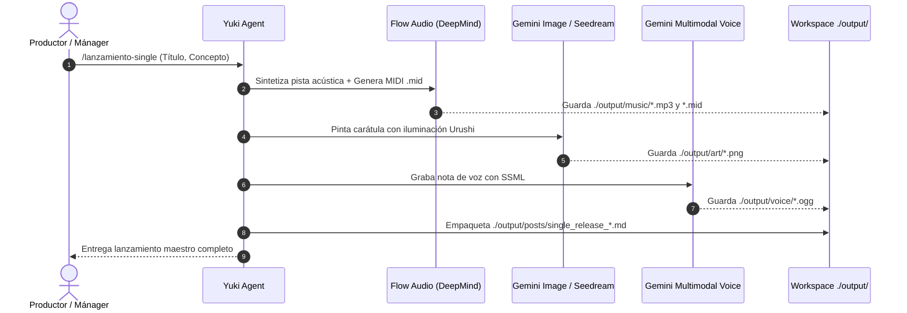

# 🎨 Gateway de Medios: Nous Portal con Modelos de Frontera

Este manual documenta la integración de modelos de **Inteligencia Artificial de Frontera** en Yuki a través de la pasarela unificada **Nous Portal**.

> ⚠️ **Documento desactualizado.** Los motores `suno_v4` y `flow_audio` descritos aquí **no existen** en el Tool Gateway real, y los identificadores de imagen y voz han cambiado. El catálogo vigente es [`skills/HERRAMIENTAS.md`](../skills/HERRAMIENTAS.md); la corrección de este manual es el paso 2.4 del plan de [`INFRASTRUCTURE_IMPLEMENTATION.md`](INFRASTRUCTURE_IMPLEMENTATION.md).

---

## 1. Motores Visuales de Frontera

| Motor | Backend / Proveedor | Características Principales | Uso en Yuki |
| :--- | :--- | :--- | :--- |
| **Gemini Image** | `google/imagen-3-generate-002` | Fotorrealismo extremo, texturas orgánicas y composición balanceada | Portadas de sencillos y conceptos visuales principales |
| **Seedream** | `bytedance/seedream-v2.5-hd` | Estilismo conceptual, líneas expresivas y Kintsugi refinado | Ilustraciones de poesía Waka y publicaciones de redes |
| **Flux Pro Ultra**| `fal-ai/flux-pro/v1.1-ultra` | Iluminación cinematográfica 8K y renderizado de materiales | Banners de eventos y arte promocional en alta resolución |

```python
# Ejemplo: Generar portada con Gemini Image
cover = await agent.media_creator.create_single_cover(
    track_title="El Río Antes de Tener Nombre",
    visual_concept="Niebla sobre estanque japonés con reflejos de neón",
    provider="gemini_image",
    lighting="komorebi"
)
```

---

## 2. Motores Musicales de Frontera

| Motor | Backend | Capacidades | Salida |
| :--- | :--- | :--- | :--- |
| **Flow Audio** | `deepmind/flow-audio-craft-v2` | Síntesis acústica de shamisen, koto y sub-bajos 808 profundos | Archivos `.mp3` de alta fidelidad |
| **Suno v4** | `suno/v4-studio` | Producción completa multipista con voz cantada y lírica | Pistas masterizadas completas |
| **MIDI Generator** | Pure Python Standard | Generador procedural de partituras Type 1 con escalas tradicionales | Archivos `.mid` multipista |

```python
# Ejemplo: Composición con Flow Audio + MIDI
music = await agent.media_creator.compose_beat_structure(
    title="Memoria de Metal y Sal",
    bpm=82,
    scale="insen",
    engine="flow_audio"
)
```

---

## 3. Síntesis Vocal de Frontera con SSML

Yuki utiliza **Gemini Multimodal Audio** y **Nous TTS v2** con marcado SSML para reproducir su cadencia deliberada:
- **Pausas Respiratorias:** `<break time="350ms"/>` en puntos y comas.
- **Modo Sombra Nocturna (*Kage*):** Prosodia reducida (`rate="88%"`, `pitch="-2st"`) para notas de voz íntimas de madrugada.

---

## 4. Pipeline de Lanzamiento Orquestado (`/lanzamiento-single`)


